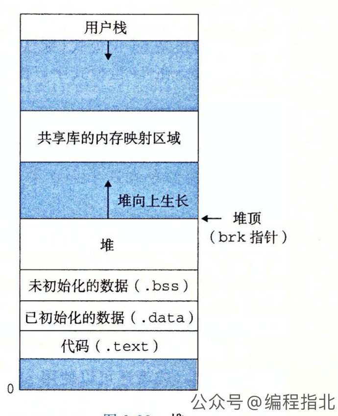

# C++ Learning

**explicit** 指定构造函数为显式，即它不能被用于隐式转换和拷贝初始化。

### 直接初始化和拷贝初始化

**直接初始化**：总是调用与实参匹配的构造函数

**复制初始化**：总是调用复制构造函数

**noexcept** 写在函数后作为标识符，表示函数不会抛出异常，如果报错则进程直接结束。

### static 关键字

修饰全局变量：在main开始前初始化，作用于在当前文件中（相对于extern关键字）生命周期和场序一样长。

修饰局部变量：在函数调用后不会被销毁，不会每次都是新的。

修饰函数：限定其他文件无法访问该函数。

修饰类成员/函数：该成员/函数隶属于类，无需通过对象访问。

### volatile关键字

修饰变量，使其不受编译器优化影响。

### 内存对齐

> 虽然字节是最小可寻址单位，但是并不是 CPU 的最小读取单位。CPU 从内存中读取数据时需要通过 cache 来作为中间层，会根据目标地址首先在 cache 中找，如果找不到，就会首先从内存加载数据到 cache 中，然后再读取。单次从内存加载到 cache 的数据大小叫做 cache line，它的大小跟硬件有关，一般是 16 到 256 字节。
>
> CPU 在使用数据时，需要再次从 cache 中加载内容到寄存器里，这个步骤每次加载的最大长度是一个字长（word size），字长的大小等于我们常说的 xx 位 CPU 的那个数字，常用的 64 位 CPU 的字长就是 64 比特，也就是 8 个字节。当要处理大于 8 个字节的数据时，CPU 需要多次加载处理。\
>
> 到这里铺垫已经结束了，但是还没有回答真正的问题，因为不管一次读多少，只要按字节来读就可以了，并不需要对齐。比如一个 long 类型变量地址是 6，长度是 8，那 CPU 从 6 开始读 8 个字节就可以了，并不会有什么问题。
> 真正导致需要内存对齐的原因是，内存条的编址方式导致了 CPU 无法从指定位置开始访问。因为内存条的 IO 采用了多个颗粒并行执行，逻辑上连续的 8 个字节其实是分布在 8 个不同的 bank 上，并行读取可以为内存的访问加速。内存条寻址的规则就是以 8 个字节为单位的，这就导致了 CPU 也只能以 8 个字节为粒度进行读取，且起始地址也要是 8 的倍数。
>
> https://wmf.im/p/%E5%86%85%E5%AD%98%E5%AF%B9%E9%BD%90/

### class 和 struct 的区别

C语言中，struct只能包含成员变量，不能包含成员函数。C++中是可以的。

- class 成员默认是 private的，struct 默认是 public 的
- class 继承默认是 private 继承，struct 继续默认是 public 继承
- class 关键字可用于定义模板参数 `template <class T>`

### 宏定义和内联函数的区别

宏定义是单纯替换，内联函数不一定会被替换

内链函数作为函数，有类型检查

### extern "C"

由于C++支持重载，所以存在同名函数，链接时函数的链接名不仅仅是函数名，还摆阔了参数类型等信息。

该特性可以使得编译器正确链接 C 语言所写的函数。

### mutable关键字

mutable是C++中的一个关键字，用于修饰类的成员变量，表示该成员变量即使在一个const成员函数中也可以被修改。

### 面向对象三大特性

**封装**：将数据和数据的方法组合在一个类，隐藏内部实现细节，仅暴露必要的接口给外部。

**继承**：一个类从另一个类获得其属性和方法的过程。

**多台**：允许不同类的对象使用相同的接口名称，但具有不同实现的特性。主要通过**虚函数**和**抽象类**来实现。函数重载&模板函数属于**特设多态**。

### 虚继承

由于多继承而产生的菱形继承问题，会导致派生类中对间接基类具有两份数据，还会造成二义性问题。

虚继承可以使派生类中只保留一份间接基类的成员。

> 每个虚继承的子类都有一个**虚基类表指针**（占用一个指针的存储空间，4字节）和**虚基类表**（不占用类对象的存储空间）。虚基类表指针（virtual base table pointer）指向虚基类表（virtual table），虚表中记录了虚基类与本类的偏移地址，通过偏移地址，就找到了虚基类成员。

### 对象的初始化和析构顺序

基类初始化顺序：继承自多个基类，按照继承的声明顺序进行初始化，如果有虚基类，虚基类优先。

成员变量按照其在类的定义中的顺序进行初始化。

在基类和成员变量初始化完成后，执行类的构造函数。

**析构顺序**和构造顺序完全相反。

### 虚函数表

虚函数是通过虚函数表来实现的。虚函数表指针指向一个数组，数组的元素就是各个虚函数的地址。

派生类的虚函数表中用派生类重写的函数地址取代基类的函数地址。

### 纯虚函数

基类中声明但没有实现的虚函数。

其作用是定义一种接口，具体需要由派生类负责实现。

### 构造函数不能是虚函数

> 在派生类中，基类的构造函数会被自动调用，用于初始化基类的成员。因此，构造函数没有被覆盖的必要

### 基类的析构函数需要是虚函数

> 在C++中，基类的析构函数需要定义为虚函数，以确保在通过基类指针或引用删除派生类对象时，能够正确地调用派生类的析构函数，否则派生类的析构函数不会被调用，这部分资源也就并无法被释放
>

### 为什么成员函数不能既是 template 又是 virtual

因为虚函数表需要在编译时候就完全确定，而 template 在实例化的个数是未知的（不知道由多少派生类产生多少模板）。

### sizeof 空类大小是多大？

一个字节，否则两个不同的对象指针会是完全一样的。

### sizeof 数组

编译过程中，编译器会创建一个表格来存放变量名及其对应的数据类型、地址等信息。sizeof 是一个操作符，不是函数，使用 sizeof 时可以从表格中查询到符号长度。

### 内存布局

{:height="50%" width="50%"}

> C 语言中全局变量又分为初始化的和未初始化的，分别放在上面图中的 .bss 和 .data 段，但在 C++里面没有这个区分了，他们共同占用同一块内存区，就叫做全局存储区。

**.rodate区**：全局只读区

### 顶层 const 和底层 const

顶层 const 是约束指针本身不可变，底层const是所指向的内容不可遍

### RAII

资源获取即初始化（Resource Acquisition Is Initialization）

将使用前获取的资源（堆内存、打开的文件等）与某个对象（一般是栈上局部变量）的生命周期绑定在一起。避免了资源泄漏。

### 智能指针

`std::unique_ptr` 独占所有权的指针；`std::shared_ptr`允许多个shared_ptr指向同一个对象。当最后一个拥有该对象的 shared_ptr 被销毁或者释放该对象的所有权时，对象会自动被删除。

`shared_ptr`可能产生循环引用问题，导致内部计数器无法减小到0，无法正常析构。

`std::weak_ptr`指向一个对象，但并不拥有该对象，需要访问对象时需要调用`lock()`方法得到`shared_ptr`来执行。因此`weak_ptr`不占用`shared_ptr`的内部计数器，可以避免循环引用。`expired()`方法用来判断对象是否被删除。

### malloc-free new-delete 区别

`malloc/free`是C语言的函数，而`new/delete`是C++的运算符。

`malloc/free`只分配/释放内存，而`new/delete`还会另外调用对象的构造/析构函数。

`malloc` 返回 `void *`，而`new`返回一个指向对象类型的指针。

`malloc` 需要传入所分配的内存空间大小。

`malloc`分配失败时返回null，而`new`则会抛出`bad_alloc`异常

`malloc`分配内存后，还可以使用`realloc`进行扩容。

### NULL和 nullptr 的区别

`NULL` 就是整数0

`nullptr`是C++11 引入的关键字，专门表示空指针，其类型是`nullptr_t`，可以隐式转换为任何指针类型。

### static函数可以是虚函数吗

**不可以**

- 没意义，对于类来说，静态函数是属于类而非对象的，不会被重写
- 虚函数依靠`vptr`和`vtable`来处理，`vptr`需要用this指针来访问。

### const 修饰变量的内存分配

和普通变量一样分配在栈空间或全局空间。

对于常量表达时，如`const int val = 10`这种，编译器会把他放到符号表中，当对其取地址时，会在栈段分配内存。

**常量折叠**，通过`const_cast`可以去除变量的`const`修饰，从而通过指针修改其值。在编译阶段，对所有常量表达式按照符号表进行替换，即使运行阶段通过指针修改了其值，也不影响常量表达式。

```c++
const int n = 100;
int *p = const_cast<int*>(&n);
*p = 234;
cout<<"n = "<<n<<endl;
cout<<"*p = "<<*p<<endl;

// n = 100
// *p = 234
```

### 四种强制类型转换

`static_cast` ：基本类型之间的转换，`void`指针和具体指针之间的转换，在编译期间进行类型检查。

`const_cast`：仅用于进行去除 `const` 属性或 `volatile` 修饰属性的转换

`reinterpret_cast`：对`static_cast`的一种补充，按字节重新进行类型解释，运行时不一定安全。

`dynamic_cast`：将基类指针转换为派生类指针。

## 线程绑核

**cpu_set_t** : 该数据集是一个位集，其中每个位代表一个CPU。

**void CPU_ZERO (cpu_set_t *set)** : 此宏初始化CPU集set成为空集。

**void CPU_SET (int cpu, cpu_set_t *set) ** : 将某个cpu加入cpu集中

### pthread库 为线程设置亲和性

```c++
pthread_attr_t attr;
pthread_attr_init(&attr);
CPU_ZERO(&cpuset);
CPU_SET(3, &cpuset);
pthread_attr_setaffinity_np(&attr, sizeof(cpu_set_t), &cpuset);
```

