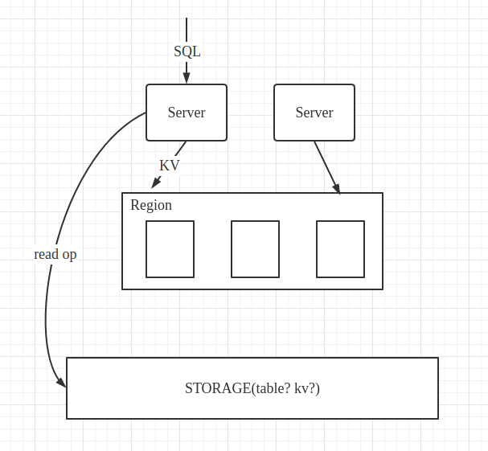
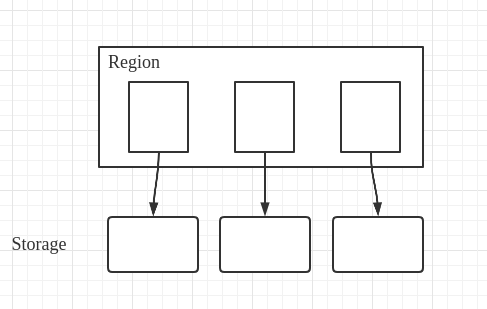
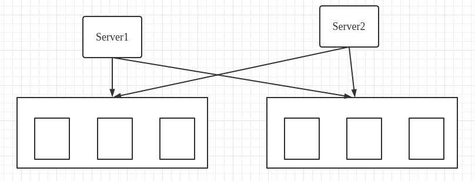

# 云原生数据库

## 云计算？

什么是云计算？为什么需要云计算？云计算的优势？

互联网需求越来越庞大和复杂，这就需要企业不断去提升它的硬件基础，诸如更强的服务器（硬件方面），更新的数据库（软件方面）。为了维护这些资源还需要专门维护工作。带来的开销更大。

将这些工作交由云服务商去做，云服务商提供一系列的所需要的各类资源（计算、存储、带宽...），使用者仅需要按其使用需要支付费用即可。

> 云计算的由是：大规模、分布式；资源虚拟化（这就好像是云服务商为每一个用户都提供了一个IDC）；高可用和扩展性；按需服务，精确计费，整体上更高的资源利用率；安全

## 云原生？

> 云原生（CloudNative）是一个组合词，Cloud+Native。Cloud表示应用程序位于云中，而不是传统的数据中心；Native表示应用程序从设计之初即考虑到云的环境，原生为云而设计，在云上以最佳姿势运行，充分利用和发挥云平台的弹性+分布式优势。

## Serverless?

> **无服务器运算**（英语：Serverless computing），又被称为**功能即服务**（Function-as-a-Service，缩写为 FaaS），是[云计算](https://zh.wikipedia.org/wiki/雲端運算)的一种模型。以[平台即服务](https://zh.wikipedia.org/wiki/平台即服务)（PaaS）为基础，无服务器运算提供一个微型的架构，终端客户不需要部署、配置或管理服务器服务，代码运行所需要的服务器服务皆由云端平台来提供。
>
> **AWS Lambda**是[亚马逊云计算服务](https://zh.wikipedia.org/wiki/亚马逊云计算服务)的一部分，它是一个[事件驱动](https://zh.wikipedia.org/wiki/事件驅動程式設計)、[无服务器](https://zh.wikipedia.org/wiki/無伺服器計算)的平台。它提供计算服务，运行事件响应代码，并自动管理计算资源。

## 云原生数据库？

问题：

1、如果考虑SQL，如何从复杂的SQL语句中获取读写集？例如含有谓词的SQL。也就是说，如何SQL to get/put

~~2、底层存储：key: table_id + row_id (primary key); value: column family~~

3、Region内分片，share-disk 还是 share-nothing？每个复制层节点有其各自的storage node还是一个Region共用一块存储？

如果是前者好像没有达到存算分离？无法单独扩展复制层或存储层。

如果是后者，是否还有分片的必要（分片间的通信代价可能大于执行代价）？

4、Server node 如何分发Txn到下面的复制层？

​	4.1、Server node 发送至所有的Region？

​	优点：每个Region始终是全副本，这样不需要Region间的同步。

​	缺点：Server发慢了的话，会导致一个epoch结束后，Region间数据不一致。

​	4.2、 Server node发送至随机的一个Region，Region内随机一个shard node。该shard node作为此Txn的primary node，转发掉不属于自己负责key的部分，暂且成为second node。

​	执行中由于违反隔离级别abort: epoch结束后，primary node需要收集所有second node的应答（success/fail）。

​	Region间合并而导致abort: epoch结束后，域间广播。可以和上一步广播同时做。（因为时延，域间>>域内）

​	违反事务原子性的需要abort：域间广播结束后，域内需要互相广播，每个shard node上abort集合做并集。

5、如何基于openGauss？openGuass整体上是一个关系型数据库，我们需要依靠openGauss获得读写集（能行么？）

