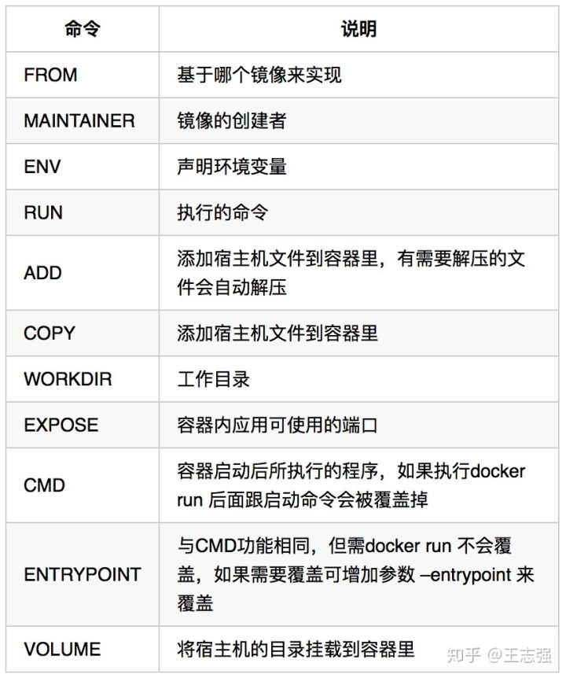

# Docker学习笔记

**容器**：简而言之，容器只是您机器上的另一个进程，它与主docker机上的所有其他进程隔离。隔离利用了[kernel namespaces and cgroups](https://medium.com/@saschagrunert/demystifying-containers-part-i-kernel-space-2c53d6979504)

**镜像**：定义容器运行时的文件系统，包括所有依赖项、配置、脚本、二进制文件以及环境变量、运行的默认命令、 和其他元数据等。

在Docker中，每个Container都是Docker Daemon的子进程。通过名空间技术，Docker实现容器间的进程隔离。

Docker鼓励“一个容器一个进程(one process per container)”的方式。

Linux 对容器内以 PID 1 运行的进程进行特殊处理：它忽略具有默认操作的任何信号。

```shell
docker run -d -p 80:80 docker/getting-started
# -d 在后台运行容器 (in detached mode)
# -p 80:80 将主机的 80 端口映射到容器中的 80 端口
# docker/getting-started 指定要使用的镜像

docker build -t getting-started . # 从当前目录Dockerfile文件构建镜像
# -t name:tag -t参数对创建的镜像命名
docker ps # 显示正在运行的容器
# 停止容器的运行
docker stop <the-container-id>
# 容器停止后，可以刪除容器
docker rm <the-container-id>

docker volume create todo-db # 创建名为todb-db的卷
docker rm -f <container-id> # 停止继续运行
docker run -dp 3000:3000 -v todo-db:/etc/todos getting-started
# -v flag 指定卷的使用 并将其挂载到/etc/todos
# 停止容器并重新启动后，可以看到之前持久化的数据

docker run -it centos:7.6.1810 # 启动进程为/bin/bash
# -i 保持容器输入为stdin
# -t 分配一个伪tty

docker commit <container-id> <image-name>:<version> # 将容器commit成镜像
docker save -o object.tar <image-name>:<version> # 打包镜像
```

## 以非 root 用户身份管理 Docker 

Docker 守护进程绑定到 Unix 套接字而不是 TCP 端口。 默认情况下，Unix 套接字由用户 `root` 拥有，其他用户只能使用 `sudo` 访问它。 Docker 守护进程始终以`root`用户身份运行。

```shell
 sudo groupadd docker.
 sudo usermod -aG docker $USER
 newgrp docker # 仅限linux，其他os需要注销并重新登录
 docker run hello-world # 验证
```

## Dockerfile编写



## Docker容器内使用宿主机代理

[**docker 容器内使用宿主机的代理配置**](https://kebingzao.com/2019/02/22/docker-container-proxy/)

[**Configure the Docker client**](https://docs.docker.com/network/proxy/#configure-the-docker-client)

## Docker容器内设置产生core dump文件

```shell
ulimit -c unlimited # 设置core文件大小为unlimited
# 修改/proc/sys/kernel/core_pattern文件为core.%e.%p
# 原来是|/usr/share/apport/apport %p %s %c %P
# 注意！需要在宿主机上切换到root用户修改
# 主机和容器中不可能同时拥有不同的 core_pattern，因为 docker 与其主机共享内核。
```

## Docker网络模式

```shell
docker network list
# NETWORK ID     NAME      DRIVER    SCOPE
# 0f7a5c16c802   bridge    bridge    local
# 94e9f9672d51   host      host      local
# e6854655c2c4   none      null      local
```

**bridge **模式：Docker 的默认网络模式，Docker 启动时创建一个虚拟网桥， 此模式会为每一个容器分配、设置 IP 等，并将容器连接到一个 docker0 虚拟网桥，通过 docker0 网桥以及 Iptables DNAT 表配置与宿主机通信。每个容器拥有自己的 Network Namespace 。

**host** 模式：容器和宿主机在同一个 Network Namespace 下。

**container**模式：容器和另外一个容器共享 Network Namespace 。实现容器互联。

**none** 模式：Docker 容器拥有自己的 Network Namespace，但是，并不为Docker 容器进行任何网络配置。

```shell
docker inspect <container-id> # 查看容器ip
```

