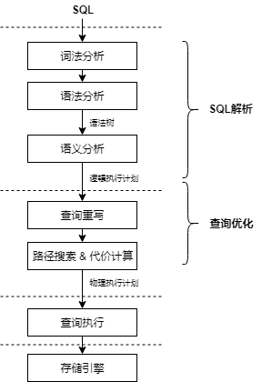
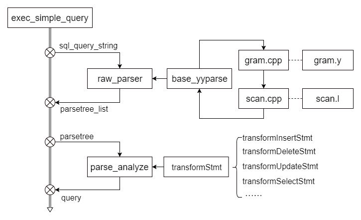
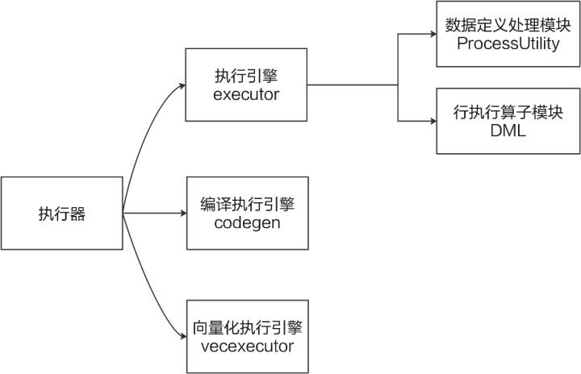
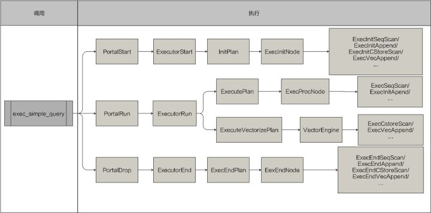
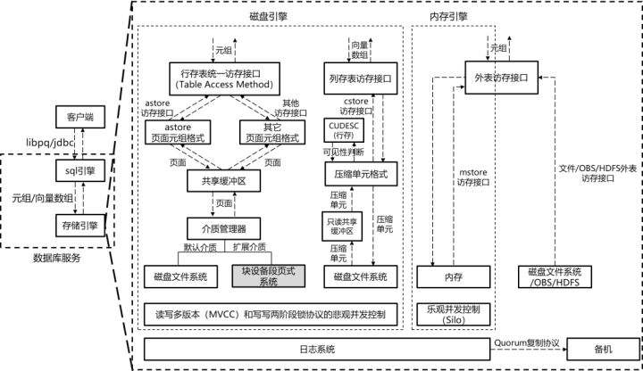
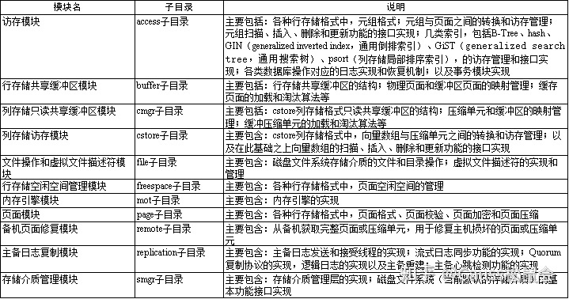
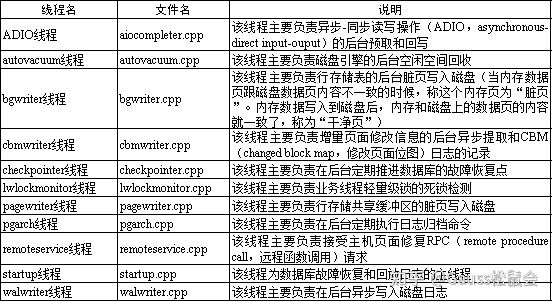

# openGauss代码笔记

openGauss数据库中处理客户端连接请求的模块叫做postmaster。

gsql是openGauss提供的在命令行下运行的数据库连接工具。

行存储格式和列存储格式共用相同的事务并发控制、日志系统、持久化和故障恢复、主备系统。对同一行数据的写-写查询冲突通过两阶段锁协议；对同一行数据的读-写查询冲突通过行级多版本技术。

## SQL引擎

通常可以把SQL引擎分成SQL解析和查询优化两个主要的模块。

### 1、SQL解析

词法分析：词法在scan.l中定义。flex工具对scan.l进行编译，生成scan.cpp文件。

语法分析：语法文件gram.y。bison工具对gram.y进行编译，生成gram.cpp文件。

语义分析：analyze.cpp下，parse_analyze会根据词法分析和语法分析得到的语法树，生成一个ParseState结构体用于记录语义分析的状态，再调用transformStmt函数，根据不同的命令类型进行相应的处理，最后生成查询树。

| 源文件                                | 说明                                             |
| ------------------------------------- | ------------------------------------------------ |
| src/common/backend/parser/scan.l      | 定义词法结构，采用Lex编译后生成scan.cpp文件      |
| src/common/backend/parser/gram.y      | 定义语法结构，采用Yacc编译后生成gram.cpp文件     |
| src/common/backend/parser/scansup.cpp | 提供词法分析的常用函数                           |
| src/common/backend/parser/parser.cpp  | 词法、语法分析的主入口文件，入口函数是raw_parser |
| src/common/backend/parser/analyze.cpp | 语义分析的主入口文件，入口函数是parse_analyze    |

### 2、查询优化

| 模块     | 目录                                                         | 说明                                                         |
| -------- | ------------------------------------------------------------ | ------------------------------------------------------------ |
| 查询重写 | src/gausskernel/optimizer/prep                               | 主要包括子查询优化、谓词化简及正则化、谓词传递闭包等查询重写优化技术 |
| 统计信息 | src/gausskernel/optimizer/commands/analyze.cpp               | 生成各种类型的统计信息，供选择率估算、行数估算、代价估算使用 |
| 代价估算 | src/common/backend/utils/adt/selfuncs.cpp src/gausskernel/optimizer/path/costsize.cpp | 进行选择率估算、行数估算、代价估算                           |
| 物理路径 | src/gausskernel/optimizer/path                               | 生成物理路径                                                 |
| 动态规划 | src/gausskernel/optimizer/plan                               | 通过动态规划方法对物理路径进行搜索                           |
| 遗传算法 | src/gausskernel/optimizer/geqo                               | 通过遗传算法对物理路径进行搜索                               |

## 执行器

openGauss在行计算引擎的基础上，增加了编译执行引擎和向量化执行引擎。

在Portal模块中根据优化器的解析结果，选择相应的处理策略和处理模块（ProcessUtility和executor）。其中executor主要处理用户的增删改查等DML（Data Manipulation Language，数据操作语言）操作。然后ProcessUtility处理增删改查之外的其他各种情况，例如各类DDL（data definition language，数据定义语言）语句等。

| 模块        | 目录                                | 说明                                                         |
| ----------- | ----------------------------------- | ------------------------------------------------------------ |
| codegen     | src/gausskernel/runtime/codegen     | 计划编译，加速热点代码执行                                   |
| executor    | src/gausskernel/runtime/executor    | 执行器核心模块，包括表达式计算、数据定义处理以及行级执行算子 |
| vecexecutor | src/gausskernel/runtime/vecexecutor | 向量化执行引擎                                               |

DML会被优化器解析并产生成计划树。

1、在PortalStart函数会遍历整个查询计划树，对每个算子进行初始化。

2、在PortalRun函数中会实际执行相关的DML查询，对数据进行计算和处理。

3、在PortalDrop函数中会调用ExecEndPlan函数对各个算子进行递归清理，主要是清理在执行过程中产生的内存。

## 事务机制

在openGauss中，事务的实现与存储引擎的实现有很强关联，代码主要集中 在src/gausskernel/storage/access/transam及src/gausskernel/storage/lmgr下。

### 事务并发控制

openGauss将事务系统分为上层（事务块TBlockState）以及底层（TransState）两个层次。

（1） 事务管理器：事务系统的中枢，它的实现是一个有限循环状态机，通过接受外部系统的命令并根据当前事务所处的状态决定事务的下一步执行过程。

（2） 日志管理器：用来记录事务执行的状态以及数据变化的过程，包括事务提交日志(CLOG)、事务提交序列日志（CSNLOG）以及事务日志（XLOG）。其中CLOG日志只用来记录事务执行的结果状态，CSNLOG记录日志提交的顺序，用于可见性判断；XLOG是数据的redo日志，用于恢复及持久化。

（3） 线程管理机制：通过一片内存区域记录所有线程的事务信息，任何一个线程可以通过访问该区域获取其他事务的状态信息。

（4） MVCC机制：openGauss系统中，事务执行读流程结合各事务提交的CSN序列号，采用了多版本并发控制机制，实现了元组的读和写互不阻塞。详细可见性判断方法见“二 事务并发控制”。

（5） 锁管理器：实现系统的写并发控制，通过锁机制来保证事务写流程的隔离性。

## 存储引擎

在磁盘引擎中，采用读写冲突优化的悲观并发控制机制：对于读、写并发操作，采用多版本并发控制（MVCC，multi-version concurrency control）；对于写、写并发操作，采用基于两阶段锁协议（2PL，two-phase locking）的悲观并发控制（PCC，pessimistic concurrency control）。

在内存引擎中，采用乐观并发控制来尽可能降低并发控制系统对业务的阻塞，以获得极致的事务处理性能和时延。

openGauss存储引擎的代码主要位于“src/gausskernel/storage/”目录下。

**存储引擎子目录**

除了以上的这些模块之外，storage目录下剩余的子目录分别属于：外表批量导入模块（bulkload子目录）、外表服务器连接模块（dfs子目录）、进程间通信模块（ipc子目录）、大对象模块（large_object子目录）、锁管理模块（lmgr子目录）。

**存储引擎后台线程**

