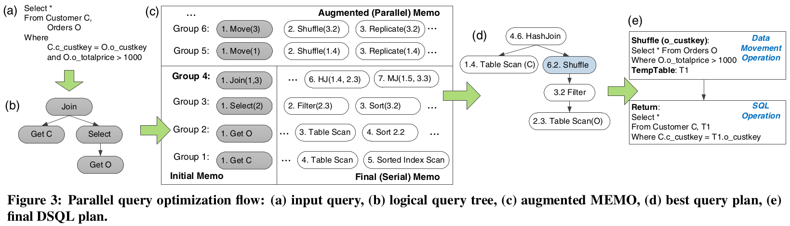
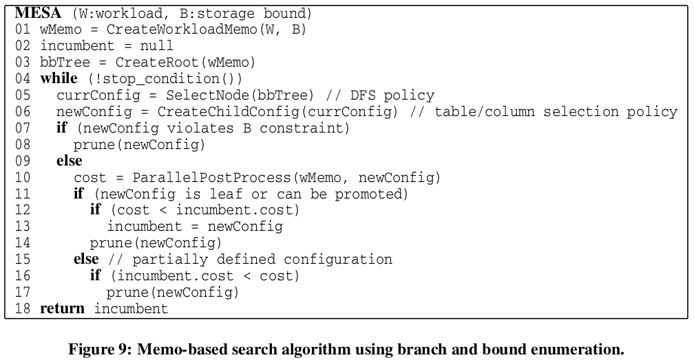

# Automated Partitioning Design in Parallel Database Systems
## ABSTRACT

提出了一个 partitioning advisor 对于预期的工作负载来提供最好的分区设计建议。

## 1. INTRODUCTION

先前关于自动分区的设计可以大致分为两类：

**optimizer-independent** ：在数据库以外对优化信息进行解释和建模。

**shallowly-integrated**  ：使用优化器作为黑盒来执行假设优化调用

**MEMO** ： 优化器的成本模型及其内部数据结构

## 2. BACKGROUND

### 2.2 Compute and Control Nodes in an Appliance

控制节点负责交互、查询解析等一系列工作，只存储了系统的元信息

计算节点负责实际执行，存储用户信息。

### 2.3 Plan Generation and Execution

并行查询优化：1、产生串行的优化搜索空间，2、枚举方案并提取最佳的执行计划。

## 3. AUTOMATED PARTITIONING DESIGN PROBLEM

## 4. TUNING WITH SHALLOW OPTIMIZER INTEGRATION

**shallowly-integrated** ：focus on 加速可行分区配置（即搜索空间）的生成，将优化器视作黑盒，执行这些假设优化。

### 4.1 Rank-Based Algorithm

优化器为每一个表累积一个list of partitions，这些分区有利于处理给定的查询并与分区生成对应的计划。然后正常评估这些计划，一旦优化器找到他认为最适合the query的计划，就提取每个table 的分区并添加到候选分区集合（candidate partition set）中。随后生成并加入那些可能被语句遗漏的分区。最后组合不同表的候选分区，为每个组合评估工作负载，返回整个workload最好的设置方案。

### 4.2 Genetic Algorithm

### 4.3 Disadvantages of Shallowly-Integrated Approaches

表多，搜索空间太大。每次分区评估包含 workload 中的所有查询，代价高。纯枚举的方法不会根据表的数量和工作负载大小进行扩展。

## 5. TUNING WITH DEEP OPTIMIZER INTEGRATION

提出了一种和优化器深度继承的分区配置调整方法。具体，提出了一种基于MEMO的新算法。

### 5.1 Workload MEMO Data Structure

创造了 “workload MEMO” 数据结构，是每个查询的 “union” 。

计划从上到下识别，代价从下到上评估。

### 5.2 Interesting Column

这个概念由在 System R 的 interesting order （上层对下层的结果顺序感兴趣）扩展而来。

两种列被认为是 interesting 的：（a）等值连接中被引用的列；（b）group-by 列的所有子集。

原因：（a）可以使得 local join possible；（b）聚合可以在每个节点本地完成，然后合并。

### 5.3 *-partitioning

引入了一种特殊概念，*-partitioning 。对于一个表来说，每一个 partition 或者 replication 都是可用的。因此，优化器可以考虑所有可选的分区对于 *-partitioned tables 来说。当然，在最终执行计划中会排除掉不合法的 partition 方式。

这种机制可以使得优化器始终为 *-partition table 选择最佳的具体分区方案，从而获得 bud node 时的成本下限。

### 5.4 Branch and Bound Search

介绍一些术语：

*Node* : 完整的或部分的 solution，节点将每个表与具体的分区策略、replication、或者 *-partition 选项连接。

*Leaf*  : 一个完整的solution，其中表不允许是 *-partition 的 。

*Bud* : 一些含有 *-partition 的表的方案，过用具体的分区方案或复制替换 *-partition table，这个节点可能会进一步增长。

*Bounding function* : 指定配置和 workload 下代价的下限。

*Incumbent* : the best fully specified solution

 S~1~ 表示一个部分 solution，第一个表在第一列分区，剩下的表在 *-partition 。

### 5.5 Branch and Bound Policies

定义下列策略：

**Node selection policy** : 如何选择下一个节点，我们使用深度优先搜索。

**Table/column selection policy** : 如何选择一个 *-partition 来实例化，以及如何分区 or 是否需要赋值该表。将所有 interesting columns 按 rank 排序，列的 rank 定义为将 c 列作为 interesting column 的所有查询的总代价。

**Pruning strategy** : 剪枝1：当前方案超过了空间限制；2：当前 bud 的代价超过了现有的 Incumbent 。

**Bud Node Promotion** : Section 5.3 如果每个 table 都提供一个唯一的 partition column，那么在实例化所有 *-partition tables后，可以将 bud node 替换为相应最优的叶子节点。

**Stopping condition** : 如果无法枚举整个搜索空间，此条件会停止搜索并返回 Incumbent 。例如基于运行时间和迭代次数。

### 5.6 MESA Algorithm

