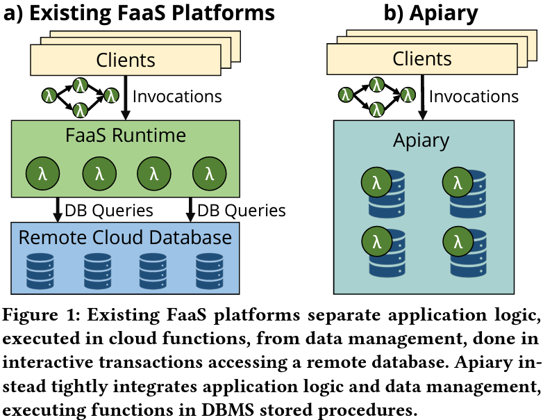

# Apiary

## Abstarct

背景：FaaS平台将在云中执行的应用**程序逻辑**和通过交互性事务访问远程storage的**数据管理**分开。会损害性能并难以提供事务保证。

Apiary是一种新的DBMS-backed事务Faas框架。紧密集成了application logic和data management并提供统一的运行，通过包装分布式数据库引擎和存储过程来完成。

[什么是Faas?](https://zhuanlan.zhihu.com/p/31386919)

## 1 Introduction

**现有的Faas平台 VS Apiary**

Apiary 将应用程序中的每个函数编译为数据库存储过程，以使函数具有事务性并提高其性能。

Apiary必须高效地执行由许多函数组成的大型 FaaS 程序，同时提供跨函数事务和exactly once语义。但现有的 DBMS 既不支持将存储过程组合成更大的程序，也不支持跨存储过程提供保证。

## 2 Background and Motivation

