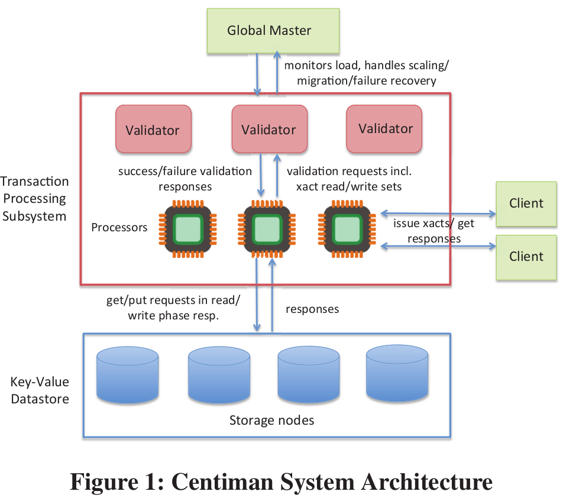
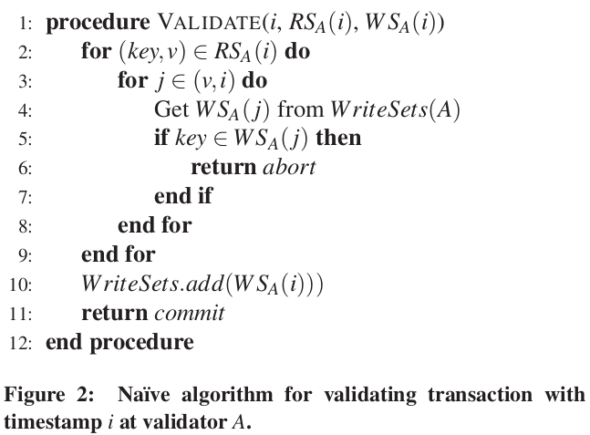
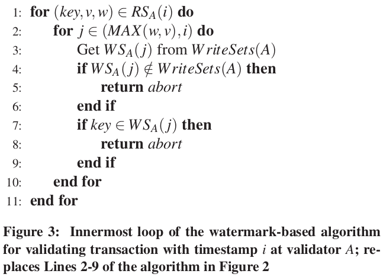
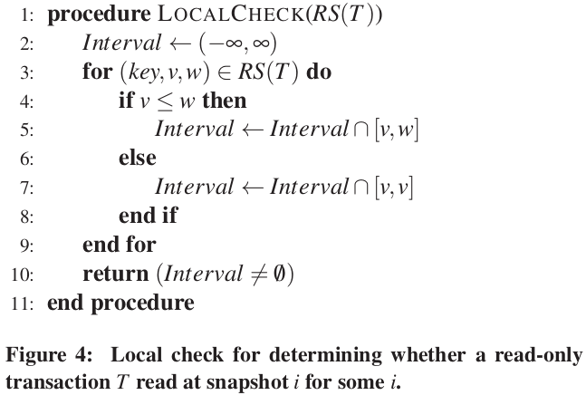

# Centiman

## Abstract 

Centiman通过一个基于OCC的协议在KV存储上实现了可序列化。Centiman为云环境设计，支持分片事务验证，Processors & Validators都可以独立扩展。

## 1. Introduction

## 2. Centiman system

### 2.1 System architecture

如图1所示，Centiman包括下列主要组件：数据存储datastore、事务处理系统（包含processors和validators）、一个全局master。

datastore仅需要支持*put(key, value,timestamp)*、*get(key)*返回*(value, version)*的API。datastore中的一个KV对作为一个记录record，每个记录和一个版本相关联。

我们要求每个processor都可以确定和时一个写被安装（installed）在datastore中。安装（installed）意味着：假设事务i写入了一个记录，后来的所有读取该记录的事务读到的版本必须大于等于i的版本。我的理解是：保证单调读。

客户端发出的事务在其生命周期内u和一个processor相关联。

validators执行OCC的一种变体。一个validator负责key space的一个子集。

### 2.2 事务生命周期

 每个事务有三个阶段：read phase、validation pahse\ write pahse。

每个事务的验证发生在一个或多个validators上，并按时间戳顺序执行。

在validator上，事务的读集在验证完毕后被丢弃，事务的写集缓存起来以可能用来验证随后的事务。

当事务i所涉及的所有validators都验证完毕后，返回结果给processor，当processor收到所有的commit响应，提交，否则中止。如果事务commit，processor将写集通过发送put请求给datastore。（可能和其他事务的读写请求交错）一旦所有的写都installed到datastore中，事务完成。

## 3. Validation in Centiman

本节介绍Centiman的主要概念贡献：sharded validation with watermarks.

### 3.1 Sharded Validation

图2是事务i在validator A处的验证算法。其中WriteSets(A)是所有j<i的WS~A~(j)。

对于读集读到的每条记录i，版本为，检查所有j(v<j<i)的写是否对同样的记录有写入，有则abort。如果验证成功，则将WS~A~(i)添加到WriteSets(A)。

WriteSets(A)会越来越大，需要基于截断的策略去处理它。

图2的算法不会违反可序列化，但是可能导致**虚假中止spurious aborts**：事务i在A处验证commit而在B处验证abort，则会使得A处仍然将WS~A~(i)加入WriteSets(A)，而对后来的事务产生不必要abort的影响。

如果将提交决定广播回验证者来消除虚假中止，会需要同步阻塞并与我们的系统目标不符。所以，我们异步传播这些消息，通过使用*水印watermark*

### 3.2 Validation with watermarks

水印是一个关于最新完成事务的时间戳的元信息。

在Centiman中，读取记录r时，收到(value,version)。由processor计算出一个水印w，有下列属性：

**Property 3.1** 如果记录r在时刻t具有水印w，那么在t时刻所有时间戳小于等于w的所有事务要么已经installed其在r上的写入，要么不会对于r产生写入。

（w是最后一个对记录r进行安装的事务id）

processor在读取时计算水印并将水印和key,version一同存储形成三元组(key,v,w)。从而可以将图2中的算法2-9行改为图3。

水印可以帮助垃圾回收：一旦所有正在进行的和将来的读取水印大于i，则回收Ws(i)是安全的。如果垃圾回收更加激进，则可能回收掉有用的Ws(i)，有时就需要保守地对事务进行abort(4～6行)。

### 3.3 Local check for read-only transactions

Centiman中不要求以原子方式安装事务的写入；因此无法保证事务读取一致的快照。processors对制度事务进行简单、保守的检查，通过则可以立即提交。

**Definition 3.2** 对于时间戳i，如果将来不会安装任何具有时间戳j<=i版本的记录；并且datastore中不存在任何具有时间戳k>i记录的版本。则定义datastore处于快照i。

**Definition 3.3** 如果事务所有读取的值都和快照i的记录一致。定义事务在快照i处读取。

对只读事务的检查算法：T的读集包括三元组(key, v, w)，假定v<w，定义区间[v, w]——一个时间范围的子集，在这个时间范围内，T所读的版本是系统中最新安装的版本。算法基于每条记录计算这样一个有效区间，并检查其交集是否为空。

### 3.4 Elastic validator scaling

global master监控系统负载，对validators进行放缩（重新划分key space）

放缩时，processors根据纠纷去和新分区发送验证请求。validators在旧分区和新分区下都运行。最初在旧分区和新分区下做出的验证决策可能不同。随着新分区下数据累积，两个分区下作出的决策会收敛。并在合适的时候完全切换到新的分区上去。

## 4. Implementing sharded validation

### 4.1 Timestamps and timestamp-order validation

时间戳可以采用TrueTime API [22] 或 Logical Physical Clocks [36] 或TSO机制。validators维护一个时间的滑动窗口，validators buffer到达的验证请求，推进窗口处理这些请求。

### 4.2 Implementing watermarks

水印的计算利用了Property 3.1的downward-closed特性：如果w满足，则任何w'<=w均满足。

每个processor维护一个*local processor watermark* Wp：和P联系的所有事务时间戳小于等于Wp的事务均已完成。所有processors的Wp取min得到W~G~；W~G~可以作为任何记录的水印。

每个processor定期重新计算其Wp；并缓存有所有其他processors的Wp；缓存信息可以定期用gossip协议同步。

更频繁地更新水印代价更高，但可以减少**虚假中止**，并允许更多只读事务通过验证。

### 4.3 Failure recovery

processor维护一个于写日志redolog，在发送验证请求之前，异步记录T的写集，随后记录T的决定。validators的故障不需要日志恢复，类比3.4中的新分区，只不过是立刻切换到新分区。