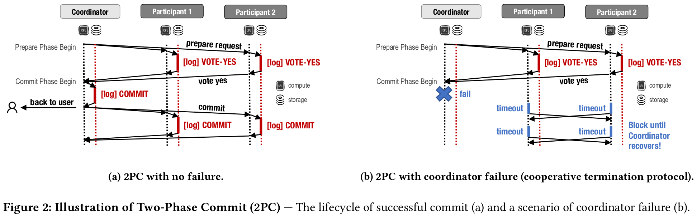
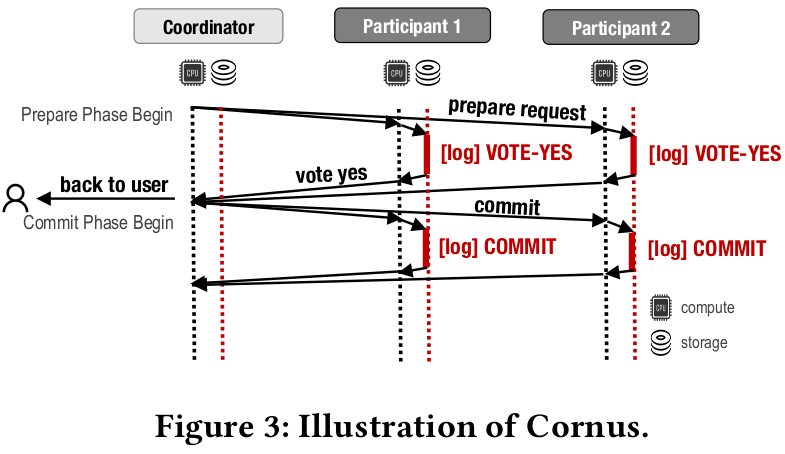
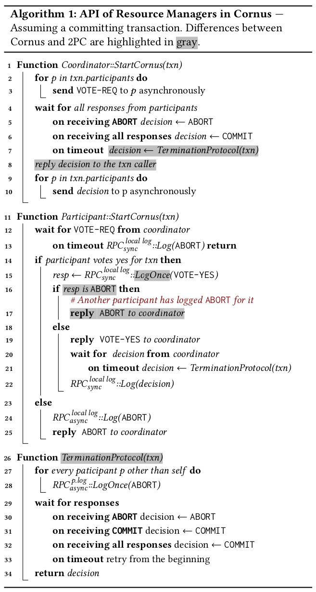
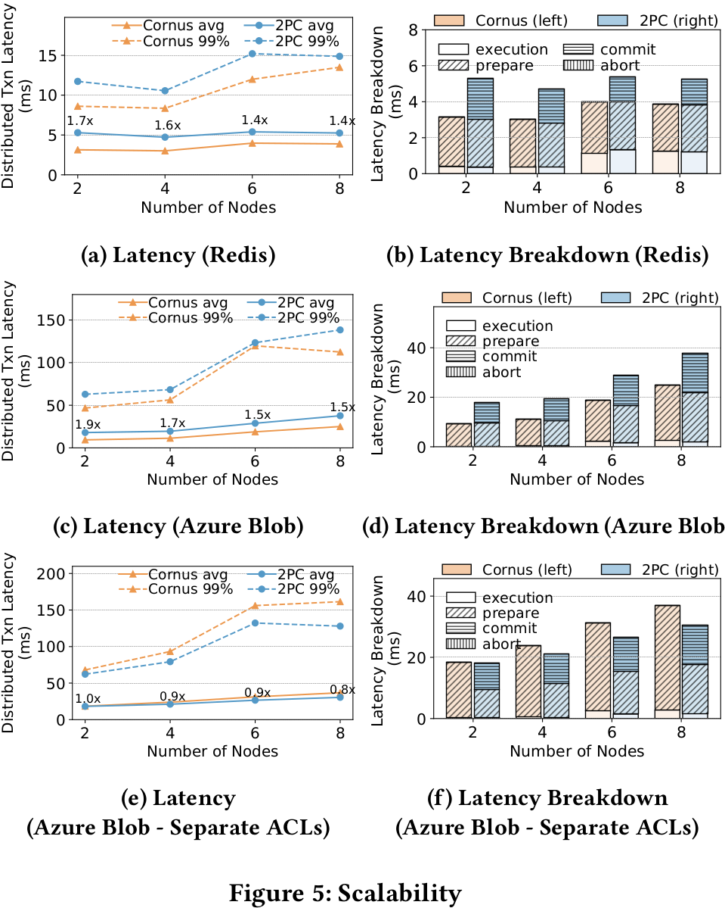
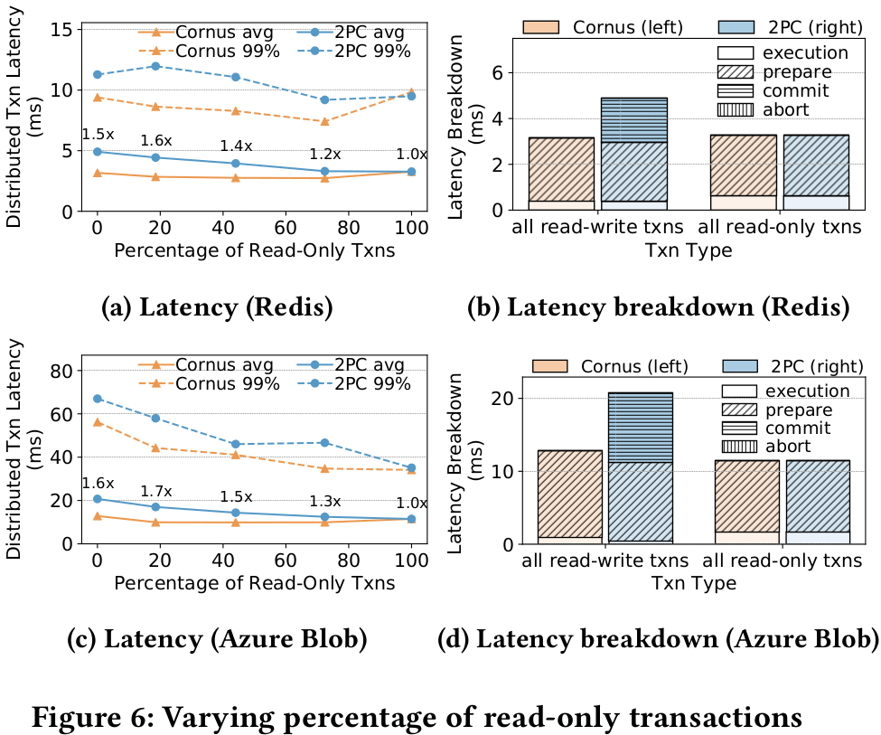
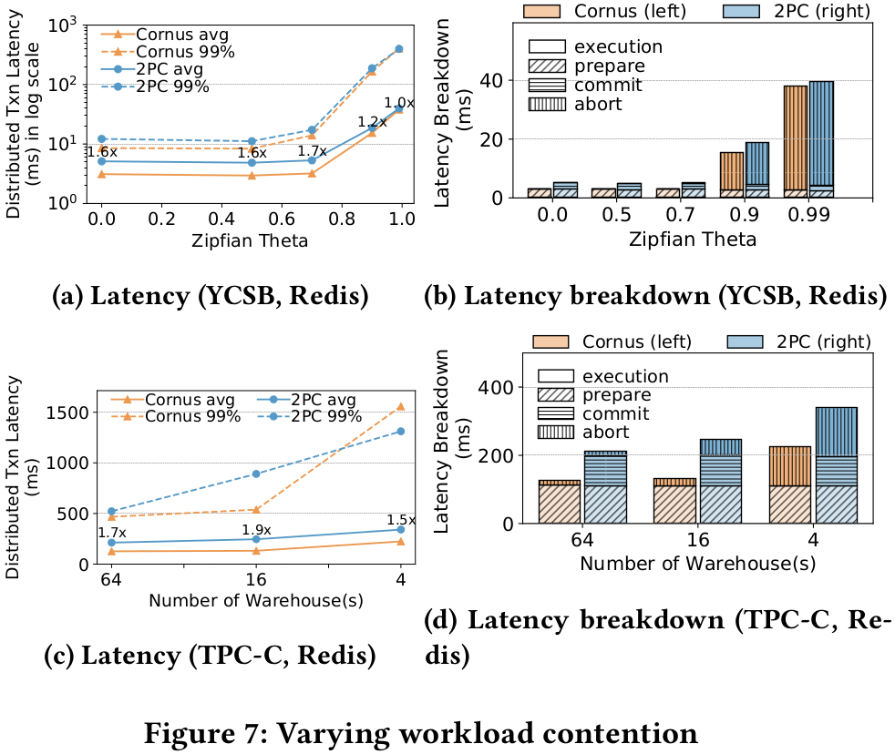
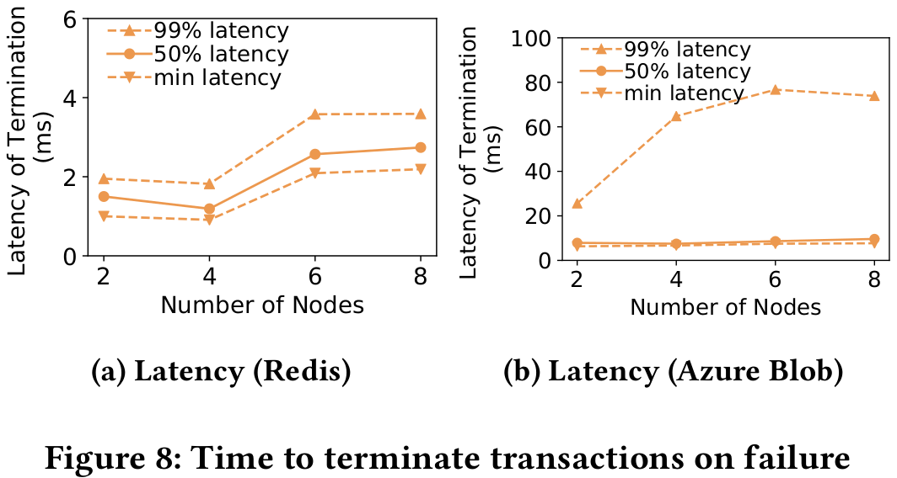

# Cornus

## Abstract

传统 2PC 为 share-nothing 架构设计，有两个局限性：

1、long latency due to two eager log writes on the critical path.

2、blocking of progress when a coordinator fails.

Cornus 需要的唯一额外功能是存储层中的原子比较和交换功能。

## 1 INTRODUCTION

对于 disaggregation storage 架构。现有的对于 2PC 中这两个问题的解决不通用。

我们介绍了 Cornus，这是一种优化的 2PC 协议，专为云原生数据库中的存储分解架构而设计。我们介绍了 Cornus，这是一种优化的 2PC 协议，专为云原生数据库中的存储分解架构而设计。

## 2 BACKGOURND AND MOTIVATION

问题1：延迟。传统 2PC 一次经历一个 rtt 和两次 log 。

问题2：阻塞。协调者在写日之前挂掉了，当前事务的状态便不确定，这会阻塞之后的一部分事务。

现有的在 share-nothing 中的做法：1、消除准备阶段（需要额外的系统假设）2、消除阻塞（额外的第三阶段）

现有的方案 Paxos Commit 在底层存储中将 2PC 和共识协议共同设计，非阻塞并且低延迟，但是需要定制存储层。

## 3 CORNUS

Cornus 是一种非阻塞、低延迟的 2PC 变体，对存储层仅需要一个接口 LogOnce() 。

### 3.1 Design Overview

Disaggregated Storage 对比 share-nothing 有如下feature：

1、内置了数据复制，高可用

2、可以被所有参与者访问

3、可以支持小的计算任务

在 Disaggregated Storage 如何降低延迟？

事务的结果不再由协调者日志决定，而是仅所有参与者的投票记录决定。

在 Disaggregated Storage 如何降低延迟？

因为集体的投票被写入 Storage ，每个参与者可以阅读所有参与者的投票了解结果。这里假设每个数据分区保存一个日志。

不确定的参与者甚至可以代替无响应的参与者写日志以强制作出决定。为了避免多个参与者对同一个 log 写入，需要`LogOnce()`。

### 3.2 Cornus APIs

`Log(txn, type)`&&`LogOnce(txn, type)`

### 3.3 Cornus Protocol

### 3.4 Failure and Recovery

#### Coordinator Failure

**Case 1：** 协调者开始前挂掉，所有参与者超时触发后本地abort

**Case 2：**协调者发出一部分vote request后挂掉，收到消息的参与者反馈 -> 超时 -> termination protocol -> 从其他参与者得知abort -> abort

**Case 3：**协调者发出所有vote request后挂掉。所有参与者反馈 -> 超时 -> termination protocol -> 查看所有log -> all vote yes -> commit

**Case 4：**协调者发出部分 decision 后挂掉。收到 decision 的参与者写日志，没收到的触发 termination protocol 查看其他log得知结果。

**Case 5：**协调者发出所有 decision 后挂掉。不影响事务后续结果。

#### Participant Failure

**Case 1：** 参与者收到 vote request 前挂掉。协调者超时 -> termination protocol -> 为挂掉的参与者LogOnce(ABORT) -> 广播 abort 决定。挂掉的参与者恢复后超时 -> 查看日志并abort。

**Case 2：**参与者收到 vote request 还没来得及写 log 就挂掉了。和 **Case 1** 相同。

**Case 3：**参与者写了 log ，没有回复就挂了。协调者超时 -> termination protocol -> 得知结果 -> 发出decision。参与者恢复后，根据本地 log 执行 commit / abort 。

**Case 4：**参与者 vote 后挂掉。参与者恢复后，查看本地 log 或 超时触发 termination protocol 了解结果。

### Read-only Transactions

在子事务是只读事务时，传统 2PC 不需要 log ,而 Cornus 需要。

### 3.6 Further Optimization Opportunities

## 4 DEPLOYMENT

需要存储服务支持 compare and swap (CAS) 以及 data privacy（隔离对于 log 中用户数据和事务状态）。

### 4.1 Deployment on Redis

同一个区域的异步主从复制。

### 4.2 Deployment on Microsoft Azure Blob Storage

数据异地冗余存储，主区域中，同步三副本复制。然后异步复制到次副本。

### 4.3 Deployment on Key-Value Databases

Amazon DynamoDB && Google Cloud Bigtable

## 5 EXPERIMENTAL EVALUATION

### 5.1 Experimental Setup

据库数据是分区的，每个计算节点运行一个资源管理器并独占访问一个分区。

在 Sundial [64] 上实现了 Cornus 。

### 5.2 Scalability

### 5.3 Percentage of Read-only Transactions

### 5.4 Contention

### 5.5 Time to Terminate Transactions on Failure

通过 termination protocol 测量中止事务的时间

### 5.6 2PC Optimizations

和 2PC 的一些特定于系统/workload 的优化版本比较

- **Speculative Precommit**
- **Coordinator Log**
- **Integration with Replication Protocol**