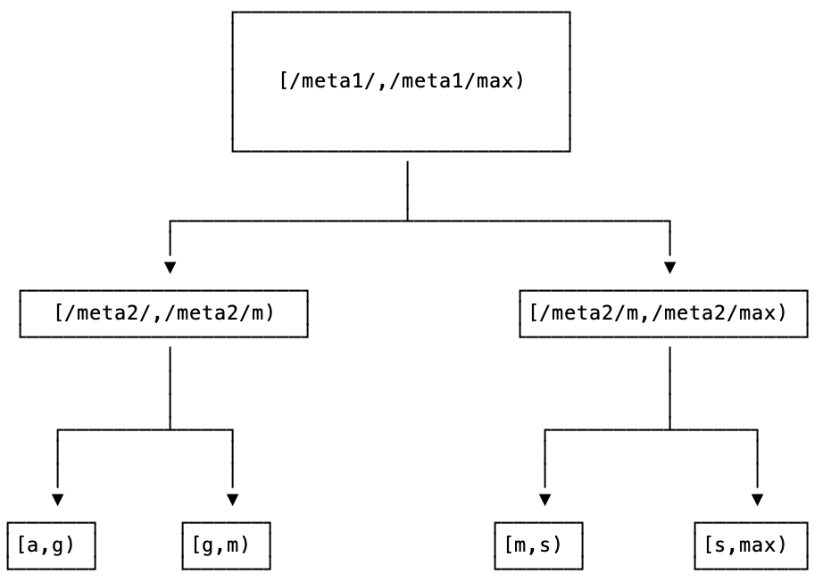

# 分布式系统数据分区

分区（partition）/分片（sharding）：含义相同

- hash分区，根据键作哈希，哈希结果作为节点选择的依据

  ——Anna、Calvin、Aria

  优点：需要的元数据仅哈希函数

  缺点：扩展问题，增加节点重新哈希

- Range分区，一段连续的键保存在一个节点上

​		——Cockroach、TiDB

​		优点：数据局部性？较hash方法更易于扩展

​		缺点：元数据较多，查找数据位置开销，热点访问

**Cockroach** ：两级索引（two-level index）meta1的信息通过gossip在所有节点之间传播 每个节点cache之前访问过的meta2信息

​		

**TiDB**: 位置信息存储在PD（Placement Driver）

## 方案

key：{table_id, row_id}

value {rest of cloumns}

**Range分区想法**：geogauss的主打是无协调，也没有使用TSO的方案，所以尽量不引入额外的协调节点为好。cockroach的数据路由方案更具有可参考性。

~~client可以连接到任何一个分区节点~~

~~每个分区节点缓存数据位置表，并向元信息节点订阅~~

~~元数据节点维护全局数据位置信息，数据路由信息发生变化，通知所有节点~~

**Hash分区想法**：考虑一个副本内，扩容锁容的问题。一致性哈希?

最笨的办法：在每次所有写集都收到后，检查本次epoch之内是否有增加/减少节点，如果有则阻塞并进行数据分布调整。

改进（thinking）：（想法：将发送写集和数据分布调整尽量一起做）~~在每次所有写集都收到后，检查本次epoch之内是否有增加/减少节点，如果有则在下个epoch内写涉及的所有位置有变化的数据，将其发送到新的正确的节点，并删除旧的entry。对于读，仍然根据旧的hash读。此时，还有在epoch内未涉及的数据仍然在旧的hash节点上……~~

**分片带来的新的challenge**：A在shard1上，B在shard2上；事务T1同时写了A和B，事务T2写了A。在一个epoch最后，需要交换写集的时候，A冲突，B没有冲突，假设T1需要被abort，但shard2感知不到这条abort信息，仍然会和其他副本就B的新值达成共识。

**solution**：多主的分片比较复杂，暂且考虑一主多从且副本分片的架构。一个分片的主副本和从副本构成raft组。事务到达某个server后，分配id并转发子事务到其他相关分片中。每个事务其子事务id一致，每个分片上physical epoch结束后，将本次epoch的所有abort事务id的广播到其他分片上。每个分片epoch结束后自动阻塞直到收到所有其他分片的abort信息，如果有机器宕机，超时之后利用raft重新选举leader继续执行；最后对于abort的事务在下次epoch开始重试事务，其余commit。

