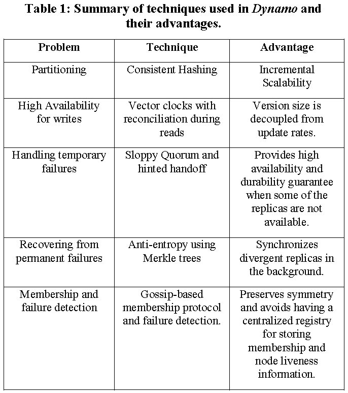
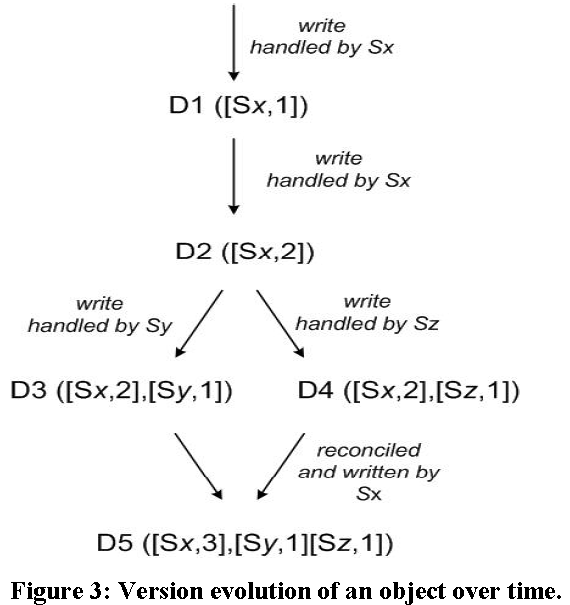

# Dynamo 

_SOSP’07_

[TOC]

## ABSTRACT

本文介绍了 Dynamo 的设计和实现，这是一个高度可用的键值存储系统。 为了实现这一级别的可用性，Dynamo 在某些故障场景下牺牲了一致性。

## 1. INTRODUCTION

Dynamo 使用一致的哈希对数据进行分区和复制，并通过对象版本控制object versioning促成一致性。多个副本之间的更新使用quorum-like和去中心化的同步协议维护。Dynamo 采用基于gossip 的分布式故障检测和成员协议。

## 2. BACKGROUND

### 2.1 System Assumptions and Requirements

_Query Model_: KV查询

_ACID Properties_: Dynamo 不提供任何隔离保证并且只允许单键更新。

_Efficiency_: 满足SLAs（Section 2.2）

### 2.2 Service Level Agreements (SLA)

### 2.3 Design Considerations

乐观复制技术：允许更改在后台传播到副本，并且可以容忍并发、断开连接的工作。

## 3. RELATED WORK

### 3.1 Peer to Peer Systems

### 3.2 Distributed File Systems and Databases

### 3.3 Discussion

## 4. SYSTEM ARCHITECTURE

### 4.1 System Interface

get(key)，返回一个object或者一个list，list包含了在一个context下版本冲突的object；

put(key, context, object)，context编码了关于object系统元信息。context信息可以通过get得到。

对key采用MD哈希生成128位的标识符，用于确定负责该该key存储的节点。

### 4.2 Partitioning Algorithm

一致性哈希：系统中的每个节点在循环空间内被分配一个随机值，代表它在环上的“位置”。通过对数据项的键进行哈希处理以产生其在环上的位置。每个节点都负责环中它与其在环上的前任节点之间的区域。

对一致性哈希的不足（节点的负载分布不均，忽略了节点性能的差异）进行了改进：引入虚拟节点的概念，每个物理节点可以对应多个虚拟节点，分配多个位置（称为tokens）。

### 4.3 Replication

每个数据项在 N 个主机上复制，N是一个参数。除去本身存储的节点，还在环中的N-1个顺时针后继节点上复制。这N个节点称为该数据的**preference list**。系统中每个节点负责环上的从其自己到第N个前继节点间的一段区域。

### 4.4 Data Versioning

Dynamo 使用向量时钟确定同个object的因果关系。(node,counter)

在Dynamo中，当客户端希望更新对象时，它必须指定要更新的版本。(通过较早的读取操作中获得的context)。在处理读请求时，如果存在冲突则返回所有objects以及包含了版本信息的context。使用该context的更新操作被认为已经协调好了不同的版本，合成一个新版本。

考虑图3，Sx分别对同一个object写入两次，状态D2。第三次对于该object处理由Sy完成，状态D3。接下来假定另一个客户端读取了D2，并且在Sz上进行更新，状态D4。

当有一个节点已经感知到了D3，并且又收到了D4，它会发现它们之间没有因果关系。两个版本的数据都必须保留并呈现给客户端。

现在假设某个客户端同时读取了D3和D4。[(Sx, 2), (Sy, 1), (Sz, 1)]。如果再次在节点Sx上更新，D5的时钟将为[(Sx, 3), (Sy, 1), (Sz, 1)]

### 4.5 Execution of get() and put() operations

客户端选择节点的两种方式：1、负载均衡器；2、分区感知客户端（partition-aware client）直接路由。

一致性：采用Quorum协议。

R：成功读取的最小节点数；W：成功写入的最小节点数。须R+W > N。get\put操作延迟由最慢的副本决定。

节点处理put请求：生成向量时钟并在本地写入新版本。将新版本连同向量时钟发送到N个节点，如果有至少W-1个节点响应，则认为写入成功。

处理get请求：向N个节点发送get()，等待R个响应后，返回给客户端，如果有多个版本则会返回其中所有不相关的版本。

### 4.6 Handing Failures: Hinted Handoff

Hinted Handoff：考虑图2，N=3，如果节点A宕机，对A副本的写入将会被发送到D上暂存。D会定期扫描，如果监测到A已经恢复，D会将暂存的副本交给A。

Sloppy Quorum

### 4.7 Handling permant failures: Replica synchronization

为了更快地检测副本之间的不一致并最小化传输的数据量，Dynamo使用Merkle树。Merkle 树是一个哈希树，其中叶子是单个key的哈希值。树中父节点是它们各自子节点的哈希值（一个list？）。

Dynamo借助Merkle树进行反熵：每个节点对于其每个key range（即一个虚拟节点）分别维护一个单独的Merkle树。如果两棵树的根的哈希值相等，则树中的叶子节点的值相等，节点不需要同步。如果不是，则意味着某些副本的值不同。 

### 4.8 Membership and Failure Detection

#### 4.8.1 Ring Membership

当一个节点第一次启动时，它会选择一系列token，并产生多个虚拟节点，将节点和tokens建立映射。映射持久化在硬盘。节点成员变更信息、映射信息、分区信息都基于gossip协议传播。

#### 4.8.2 External Discovery

Dynamo环有可能逻辑分区：A加入环，然后将B加入环。 在这种情况下，节点A和B将各自认为自己是环的成员，但两者都不会立即意识到对方。为了防止逻辑分区，一些Dynamo节点扮演种子的角色。 种子是通过外部机制发现并被所有节点所知的节点。

#### 4.8.3 Failure Detection

如果节点B不响应节点A的消息（即使B响应节点C的消息），节点A认为节点B失败。然后节点A使用代替节点为映射到B分区的请求提供服务；A定期检查B的恢复情况。

### 4.9 Adding/Removing Storage Nodes

新节点加入后，会被分配一些在环上的token。则可能会有一些现有节点不再需要某些key range并转移给新的节点。

## 5. IMPLEMENTATION

在读取响应返回给调用者后，状态机等待一小段时间以接收任何未完成的响应。 如果在任何响应中返回过时版本，协调器将使用最新版本更新这些节点。 此过程称为读取修复，机会主义地修复非最新地副本。

写入的协调器被选择为对存储在请求的上下文信息中的先前读取操作响应最快的节点。这种优化能够选择具有由先前读取的数据的节点，从而增加获得“read-your-writes”一致性的机会。

## 6.EXPERIENCES & LESSONS LEARNED

Dynamo优势在于其客户端应用程序可以调整N、R和W的值，以达到其所需的performance, availability和durability。

测量使用(N,R,W)=(3,2,2) 的配置。

### 6.1 Balancing Performance Durability

使用Dynamo的服务所需的典型SLA是99.9%的读写请求在300毫秒内执行。

图 4 显示了 Dynamo 读取和写入操作在 30 天内的平均延迟和 99.9% 的延迟。

一个优化：每个存储节点在其主存中维护一个对象缓冲区。 每个写入操作都存储在缓冲区中，并由写入线程定期写入存储。参见图，将高峰流量期间 99.9% 的延迟降低了 5 倍，但是降低了durability。

### 6.2 Ensuring Uniform Load distribution

图6研究负载不平衡和请求负载的相关性。

在低负载时，不平衡率高达 20%，而在高负载时，则接近 10%。

解释：在高负载下，会访问大量流行的键，并且由于键的均匀分布，负载是均匀分布的。 但是，在低负载期间，访问流行的键较少，从而导致负载不平衡度更高。

**图7：图 7：三种策略中键的分区和放置。 A、B 和 C 描述了三个不同节点，它们构成了一致哈希环 (N=3) 上密钥 k1 的preference list。 阴影区域表示节点 A、B 和 C 形成preference list的key range。 黑色箭头表示各个节点的token位置。**

分区策略1：每个节点有 T 个随机tokens并按tokens值分区。

不足：节点的加入和移除会导致许多节点的key range变化。从而导致Merkle树重新计算、减慢bootstrap速度。

分区策略2：每个节点有T个随机tokens和大小相等的分区：哈希空间被划分为 Q 个大小相等的分区，tokens仅用于构建将哈希空间中的值映射到节点的有序列表的函数，而不是决定分区。

优点：（i）分区和分区放置的解耦，以及（ii）能够在运行时更改放置方案。

分区策略3：每个节点有Q/S个tokens：每个节点都分配有Q/S个tokens，其中 S 是系统中的节点数。 当一个节点离开系统时，它的tokens会随机分配给剩余的节点，从而保留这些属性。当一个节点加入系统时，它会以一种保留这些属性的方式从系统中的节点“窃取”tokens。

实验：评估每个策略的负载均衡效率。图8

### 6.3 Divergent Versions: When and How Many?
### 6.4 Client-driven or Server-driven Coordination 

表 2 显示了使用客户端驱动和服务器驱动的方法做协调的对比。

改进是因为客户端驱动的方法消除了负载平衡器的开销，以及在将请求分配给随机节点时可能产生的额外网络跳转。

### 6.5 Balancing background vs foreground tasks

使用一种机制，一个控制器在前台执行get、put时监视资源的访问情况。检查所跟踪时间窗口中的延迟（或故障）百分位数是否接近给定的阈值。决定有多少时间片用作后台任务。

### 6.6 Discussion

要扩展到数万个节点时，维护路由表的开销会加剧，这个限制可以通过向 Dynamo 引入分层扩展来克服。[14]解决了这个问题。

## 7. CONCLUSION

