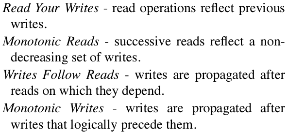

# HAT 高可用事务

[toc]

## ABSTRACT

本文工作：考虑提供**Highly Available Transactions (HATs)**时的问题：事务的保证在系统分区(system partitions)时仍然available，同时也不会导致很高的网络延迟。

贡献：对highly available systems进行了一个分类(?)，并且分析了ACID隔离级别和分布式数据一致性保证，目的是确定这其中哪些可以，以及哪些不可以在HAT的系统中实现。

将弱事务隔离、副本一致性和高可用系统方面的文献作了一个统一。

## 1 Introduction

论文调查表示，除了可串行化之外，快照隔离和可重复读取隔离不符合 HAT 标准，而大多数其他隔离级别都可以实现with high availability。

HAT相较于传统的分布式serializability协议可以获得1～3个数量级的延迟降低。但是HAT无法满足对并发敏感的应用程序。

## 2 Why High Availability

在本节中，我们利用一系列证据表明分区在实际部署中频繁发生，并且数据中心之间的延迟很大，通常为数百毫秒。

## 3 ACID in the Wild

先前的工作已经研究了可序列化性和高可用性 [28] 以及一般的弱隔离 [2, 12, 38] 之间的关系，但没有将弱隔离和高可用性结合在一起。本文其余部分的主要目标是了解哪些模型符合 HAT 标准。

## 4 High Availability

如果用户可以联系到一个正常的server，且最终一定会收到来自server的response，即使在servers之间存在任意的、无限长的网络分区。则称该系统提供了**高可用high availability**。

### 4.1 Sticky Availability

分布式算法通常假设客户端在后续操作中始终联系相同的逻辑副本。由此，客户端先前的每个操作（其他客户端的操作不一定），都会反映在其观察到的数据库状态中。

客户端可以通过保持与服务器的stickiness来确保操作之间的连续性。在全复制系统中为一个server，在副本复制系统中，则为一组server构成的逻辑副本。

如果无论何时一个客户端的事务针对反映客户端所有先前操作的事务库状态副本执行时，它最终都会收到响应，则称系统提供了**sticky availability**。

### 4.2 Transactional Availability

如果一个事务可以为其访问的每个item联系上至少一个replica，则称该事务具有副本可用性**replica availability**。如果给定副本可用性，该事务最终能够提交或者因内部原因abort，则称该系统提供了事务可用性**transactional availability**。如果给定**stiky availability**，事务最终能够提交或内部abort，则称系统提供了**sticky transactional availability**。

## 5 Highly Available Transactions

我们主要借鉴了 Adya 的论文 [2]，并在一定程度上借鉴了它的前身作品：ANSI SQL 规范 [5] 和 Berenson 等人随后的批判 [12]。

写操作——$w_d(v)$: 对d项写入值v；读操作——$r_d(v)$ : 对d项读取得到v。

### 5.1 Achievable HAT Semantics

#### 5.1.1 ACID Isolation Guarantees

Adya 将**Read Uncommitted** 隔离级别作为_PL-1_. _PL-1_要求禁止 Adya 的 _G0_ 异常（即，“脏写”）

**Read Committed**是Adya的_PL-2_.禁止Adya的_G1{a-c}_(or ANSI的P1，or  “broad” P1 from Berenson et al.) 这既禁止了上述的“脏写”，也禁止了“脏读”现象。

根据ANSI标准化的，与实现无关的**Repeatable Read**定义，其禁止了“Fuzzy Read” (or P2) 在本文中，为了消除“Repeatable Read”的其他定义之间的歧义，我们称呼这种property为“cut isolation”。对于离散数据，如果可以保持这种property，则称为**Item Cut Isolation**，如果我们期望基于谓词的读取(e.g., SELECT WHERE;
preventing Phantoms [38], or Berenson et al.’s P 3/A3) 我们这种更强的property为**Predicate Cut-Isolation**.

#### 5.1.2 ACID Atomicity Guarantees

原子性虽然不是一种隔离级别，但是它也限制了事务更新的可见性。因此，我们考虑原子性带来的隔离效应，称之为**单调原子视图Monotonic Atomic View**隔离。Under MAV，一旦事务T~i~的一些effect被另一个事务T~j~观察到了，此后，所有T~i~的effect都会被T~j~观察到。

together with item cut isolation，MAV能够防止读偏Read Skew异常(Berenson et al.’s A5A)

具体的例子：under MAV，因为T~2~读到了T~1~对于y的写入，T~2~一定能观察到b=c=1(或者更later的版本)

​														$T_1 : w_x(1) w_y(1) w_z(1)$

​														$T_2 : r_x(a)r_y(1)r_x(b)r_z(c)$

T~2~也可以观察到a=空，a=1或者更新版本的x。

我们将MAV置于Adya的_PL_2L_之下，Read Committed(_PL_2_)之上。

#### 5.1.3 Session Guarantees

session描述了因该在事务之间持续存在的上下文，例如用户“登陆”和“注销”之间提交的所有事务可以组成一个session。一些session一致性可以实现具有high availability。

**Monotonic read**，在一个session内，对某个对象的读取“从不返回任何之前的值”。每个item的读取根据一个全局顺序推进。(时间不会倒退)

**Monotonic writes**，session内的所有写是按照他们提交的顺序变得可见的。只有当副本包含session中先前的写入时，才将写入合并到数据库副本中。

eg. 有了Monotonic Writes，保证了对文章版本N的修改会出现在版本N+1之前，否则版本N+1就会被版本N覆盖。

**Writes Follow Reads**，确保在所有服务器上的写入顺序中，保留了传统的写入/读取依赖关系。也就是说，在数据库的每个副本中，所有数据依赖（RAW、WAR）不会改变。写操作被安排在其先前的的读已经观察到的所有写之后。

eg. 一个写操作W~1~创建了一篇文章，R操作读取了文章内容，W~2~创建了文章的评论。那么显而易见，在其他server上，也应该先有W~1~，后有W~2~。

[reference](Session Guarantees for Weakly Consistent Replicated Data)

上述保证的问题：事务读不到自己的写入。在分区下，不幸的客户端将被迫向分区的，过时的服务器发出其下一个请求。

解决方案：放弃high availability并满足sticky availability。sticky availability具有三个额外的保证。

**Read your writes**，要求无论何时客户端读取一个它之前更新的item，都返回更新后的结果或者一个被覆盖的更新的结果。

**PRAM**（Pipelined Random Access Memory），提供了在session中序列化所有操作的illusion，并且是**Monotonic read、Monotonic write、Read your writes**的结合体。

**Causal consistency**，是上述所有session保证的组合。在Adya中作为_PL_2L_被提及。

Read your writes在highly available system是做不到的。（由于网络分区，前一次写入和后一次写入不在一个replica上）。

#### 5.1.4 Additional HAT Guarantees

在 HAT 系统中可实现的另外两种保证。

**Consistency**，HAT系统可以作出有限的application-level的一致性保证。如，执行可交换的，和逻辑上单调的操作，而不会破坏完整性约束。

**Convergence**，在任意（但不是无限延迟）下，HAT 系统可以确保最终一致性。通常是通过反熵协议实现的，which 定期使用每个数据项的最新值更新相邻服务器。

### 5.2 Unachievable HAT Semantics

在 HAT 系统中无法防止丢失更新或写入偏斜。

#### 5.2.1 unachievable ACID Isolation

**丢失更新**：考虑在网络分区的两个replica提交以下 T~1~ 和 T~2~ 的两个客户端：

​				$T_1:r_x(100)w_x(100+20=120)$

​				$T_2:r_x(100)w_x(100+30=130)$

**写偏**：事务T~1~读y，事务T~2~读x，之后T~1~写入x并提交，且T~2~写入y并提交。

​				$T_1:r_y(0)w_x(1)$

​				$T_2:r_x(0)w_y(1)$

x和y存在完整性约束：任何时候x和y只能有一个为1。则写偏违反了完整性约束。

#### 5.2.2 Unachievable Recency Guarantees

HAT系统无法一定保证recency。

#### 5.2.3 Durability

### 5.3 Summary

## 6 HAT Implication

### 6.1 HA and Existing Algorithms

### 6.2 Application Requrements

许多（但不是全部）TPC-C 事务都由 HAT 很好地服务。 存在两个有问题的事务，New-Order和Payment，都需要防止丢失更新。

### 6.3 Experimental Costs

_Implementation_：一个部分复制的，基于LevelDB的原型DB。支持最终一致eventual（**last-writer-wins的RU** with **all-to-all anti-entropy between replicas**），MAV（refer to Section 5.1.2），non-HAT操作（给定key的所有操作都被路由到master执行，以及分布式2PL）

_Configuration_：以cluster为一个replica部署。（cluster类似于OB Zone的概念）cluster跨数据中心，并将数据中心内的客户端stick to相应的cluster。YCSB（0.5读0.5写），每8个YCSB操作作为一个事务。

_Geo-replication_：

图见论文。

图3，A&B，master的吞吐量和延迟大受影响，反之，HAT则几乎没变。当增加到5个datacenter时相同。

图4，反映了现在的MAV算法所需元数据量与数据长度成正比，消耗了IOPS和网络带宽。

图5，vary操作所占比重。

图6，扩展性，增加cluster内的server数量。

## 7 Related Work

## 8 Conclusion and Future Work

