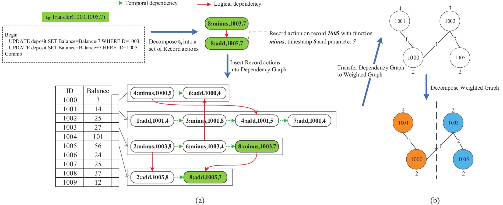
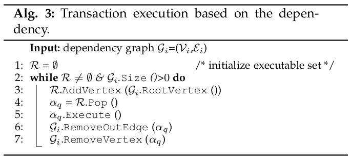
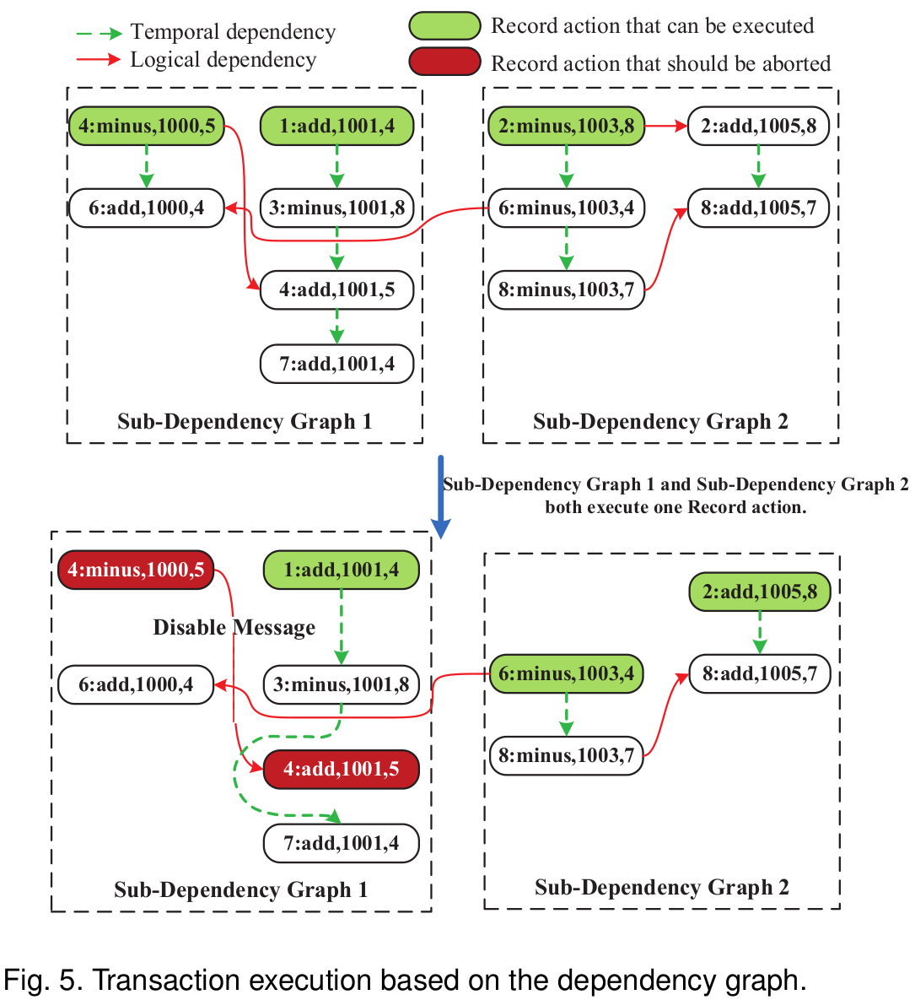

# LADS

 ## Abstarct

提出了一个动态单线程内存OLTP系统——LADS。LADS 的关键创新是将依赖关系解析和执行分离成两个不重叠的阶段。

## 1 Introduction

背景：硬件发展了，内存OLTP性能却乏善可陈。

LADS。将并发控制与事务执行分离。

LADS首先将一批事务解析为一组记录操作（recrod action），一个记录操作是对同一个元组的连续（原子）操作序列。

LADS利用依赖图来确定一批事务中记录操作之间的依赖关系，然后将依赖图分解为子图，使得子图的大小大致相同，并且这些子图中的边数最小化。

最后将子图分发到可用的工作线程以执行。

LADS使用动态的划分，根据数据实际分布动态地对工作负载进行分区。

## 2 RELATED WORK

## 3 TRANSACTION PROCESSING IN LADS

### 3.1 Dependency Graph Construction

**Definition 1 (Record Action)**：一个事务中对同一记录连续执行的操作，记作$\alpha$。

$r(\alpha)$ 指代在$\alpha$上的记录；$c(\alpha)$ 、$f(\alpha)$、$\rho(\alpha)$ 分别指代其上的时间戳、函数集和参数集。

**Definition 2 (Logical Dependency)**：$\alpha_i\succ _{logic} \alpha_j$  $\alpha_i$逻辑上依赖于$\alpha_j$ 

如果$\alpha_i$和$\alpha_j$ 属于同一个事务，并且$\alpha_i$必须在$\alpha_j$ 之后执行。

**Definition 3 (Temporal Dependency)**：$\alpha_i\succ _{temporal} \alpha_j$

如果$\alpha_i$和$\alpha_j$ 属于同一个事务，并且$\alpha_i$时间戳后于$\alpha_j$ 。

$L(k)$：为每个刚在图中被访问的record k 维护的最新record action。

$\phi_k$：维护record的一个action 队列。

不同的工作线程并行构建多个依赖图。

### 3.2 Dependency Graph Partitioning

尽可能划分为相同大小且跨partition边数最小。

……

### 3.3 Transaction Execution

确保所有woker线程完成图构建和分区后，同时进入执行阶段；需要一个全局同步。

每个worker使用Alg.3的算法执行操作。

类似拓扑排序：worker从子图中选择没有入边的记录操作，并将其插入到worker维护的一个可执行队列中。然后从可执行队列中选择要执行的record action。在执行完毕后，删除该节点以及所有出边。迭代。直到子图中的所有record action都被完全执行。

LADS 在事务执行之前对操作进行重新排序，以便可以在较短的时间间隔内执行对同一记录的操作，从而提高缓存命中率。

多个依赖图处理是顺序的。

#### 3.3.1 Handing Transaction Aborts

事务虽然不会冲突，但仍会因为数据库字段约束而abort。

为了防止级联中止：在每个事务中添加一个条件变量检查函数作为每个事务的第一个record action，其他record action在逻辑上依赖之。如图5

#### 3.3.1 Handing Range Queries

针对范围查询，LADS以更粗粒度的方式去处理。视为一个需要更新整个列、表或分区的record action。所有后续在该列、表、分区的record action都必须依赖于。