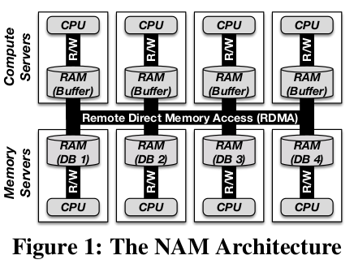
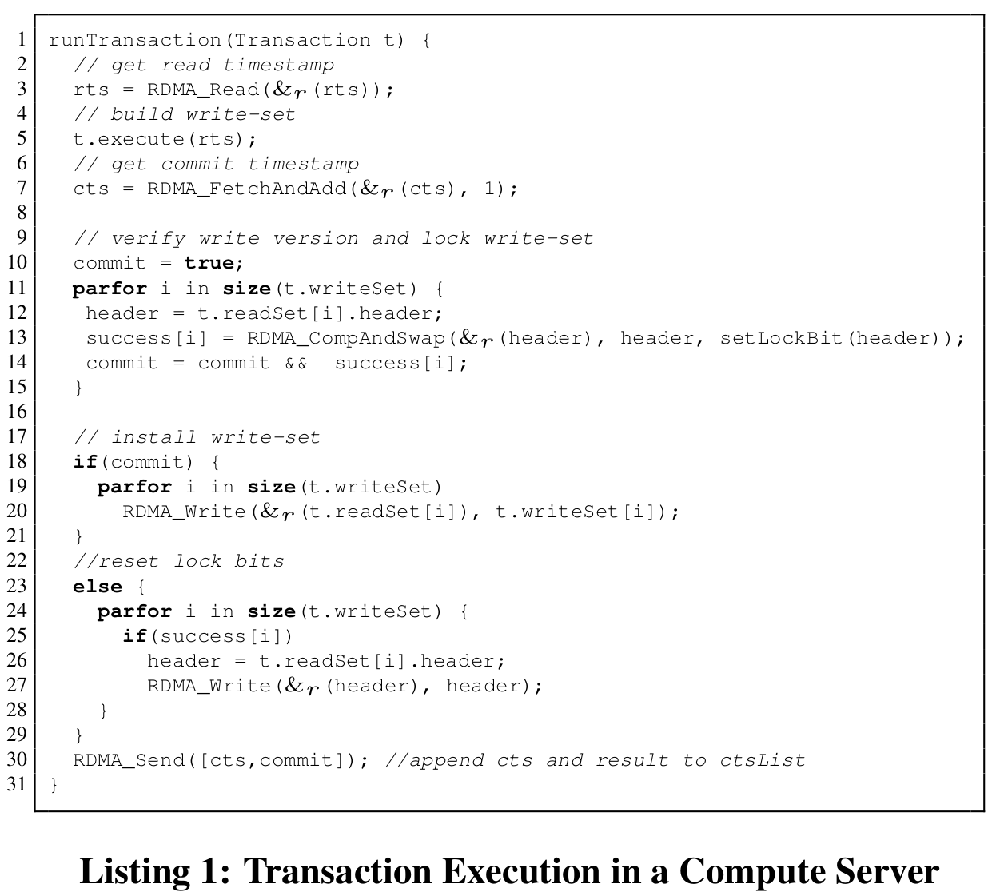
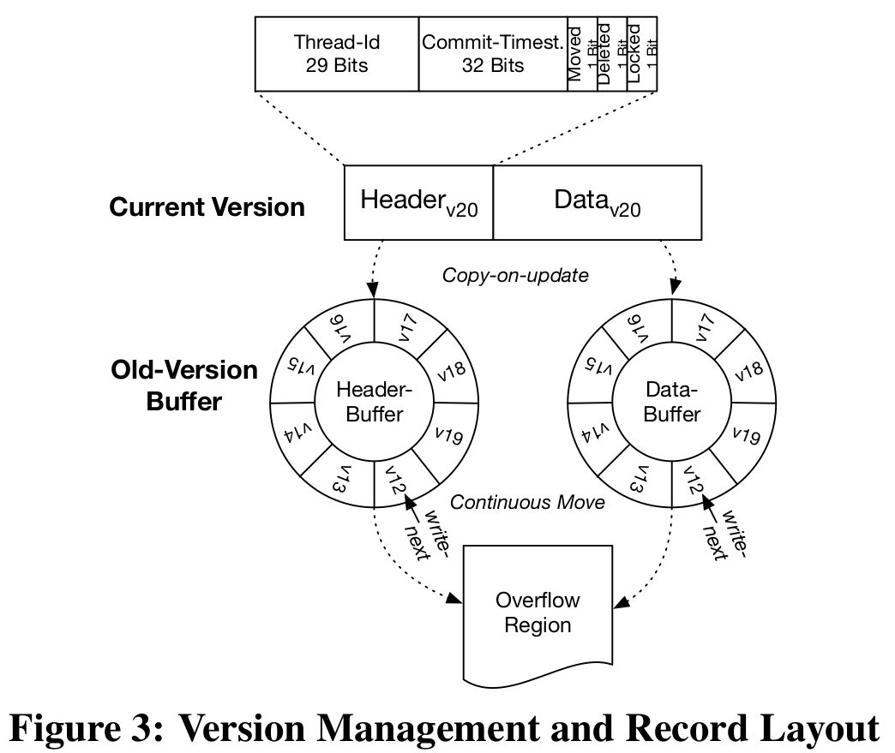

# The End of a Myth

## ABSTRACT

提出了使用 RDMA 网络技术的数据库系统 NAM-DB。

## 1 Introduction

### 1.1 Why Distributed Transactions are considered not scalable

1、CPU 大部分资源被处理网络消息所占用。

2、网络带宽很容易占满

### 1.2 Why we need a System Redesign

采用了 RDMA 的系统既不是分布式共享内存系统（存在多个地址空间且没有缓存一致性协议），也不是纯粹的消息传递系统（可以直接访问数据）。

本文系统针对于如何利用 RDMA 实现真正的可扩展设计，还能提供快照隔离。

### 1.3 Contribution ans Outline

1. 设计并实现了 NAM-DB with Snapshot Isolation
2. 基于 RDMA 可扩展的全局计数器
3. 跑了 TPCC 实验

## 2 System Overview

RDMA 提供了 verbs API，当使用 API 时由 RDMA NIC 处理，而不涉及 OS 。

### 2.1 The NAM Architecture

NAM 在逻辑上分离了计算节点和存储节点。使用 RDMA 在所有节点之间通信，如图1所示为一个分布式内存池来支持数据存储。

### 2.2 Design Principles

- **Separation of Compute and Memory**
- **Data Location Independence**
- **Partitionable Data Structures** : 每个数据结构都是可分区的，以避免单点瓶颈

## 3 The Basic SI-Protocol

具有 SI 保证的事务只有在想要更新自事务开始后写入的项时才会中止。

### 3.2 Open Problems and Challenges

全局时间戳仍然是单点瓶颈。

可能 ”stale“ 读，如果 timestamp management thread 没有来得及推进 read timestamp

slow worker 和 long txn 会 holding back 住快照 从而拖延了更新

## 4 Timestamp Oracle

### 4.1 Scalable Timestamp Generation

**timstamp vector**

$T_R = <t_1,t_2,t_3,...,t_n>$ ： 代表读时间戳，$t_i$ 是一个 unique 的计数器，i 是事务执行线程标识符。

$T_C = <i,t_i>$ ：$t_i$是对应的commit timestamp ， 对每条 record 存储的版本向量

**Commit Timestamps** ：每个 $t_i = T_R[i]$ 代表了 执行线程 $i$ 的最新 commit timestamp。当事务执行完成后，计算节点增加 $T_R$ 中的提交时间戳来使得更新可见。

**Read Timestamps** ：每个线程使用 $T_R$ 作为 read timestamp *rts* 。并可以和 record 的版本向量比较来检查是否最新版本是可见的。

如果时间向量保存在一个机器上，那么仍然可以保持单调性。

### 4.2 Further Optimizations

**Dedicated Fetch Thread** ：使用专门的线程不断获取 $T_R$ ，看似增加了 staleness，由于网络负载的减少，每个事务的运行间时间大大减少，实际上获得了更低的中止率。

**Compression of $T_R$ ** ：事务执行线程变多，会使得 vector 的 size 变大。考虑不是一个线程一个占一个 slot ，而是一个计算节点一个 slot 。一个可选方案：同一台机器的所有线程共享一个 $t_i$

**Partitioning of $T_R$** ：$T_R$ 的分区会导致不同线程观察到的顺序可能不同，这个问题还没解决。

## 5 Memory Servers

### 5.1 Multi-Versioning Scheme

Old-Version Buffer 是固定大小的。

**Record Layout** ：如图3所示，分为 Header & Data ，都是定长的。

**Version Management** ：old-version 的 Header 和 Data buffer 是分开的，Header 的 size 远小于 Data，所以查找时只搜索 Header 部分，利用偏移量定位 Data。

### 5.2 Table and Index Structure

**Table Structures** ：哈希表实现，以键值对的方式存储，value 为三个指针，指向 current version、old-version buffers 和 overflow region。表被分区到多个内存服务器。计算节点通过哈希函数确定 entries 位置。

**Index Structures** ：支持 single-key 查询的哈希索引和 range 查询的 B+-tree 索引。

### 5.3 Memory Management

内存服务器在初始化时申请一大块内存，注册到 RDMA 网卡（NIC）上。

**Allocate and Free Calls** ：通过双边 RDMA 操作实现。

**Garbage Collection** ：最大事务执行时间 E，每分钟捕获一个快照，并按顺序存在列表，根据 E 的值在 overflow regions 进行垃圾回收。

## 6 Compute Servers

### 6.1 Transactions Execution

目录如何实现的？目录通过哈希分区存在内存服务器上。被 cached 在计算节点上，在以下两个 case 时刷新：

1）cache 未命中，计算节点请求所需元数据。

2）数据库被 alter ，在每个内存服务器存储一个目录版本计数器，该服务器上的表结构更改则递增。在事务编译之前，查询该计数器并与 cache 在计算节点的吸纳更比较，如果变化了则刷新。

### 6.2 Failures and Recovery

**Memory Server Failures** ：执行线程写私有日志到内存服务器 by RDMA writes。日志格式为$<T,S>$，T 是事务读的时间戳向量，S 是事务的执行状态以及所有参数。为了避免丢失，要写到多个内存服务器。一旦一个内存服务器出现故障，停止整个系统，并恢复到与最后一个 checkpoint 一致的状态。按照日志顺序 reaplay 。

使用异步线程额外的将 checkpoint 写入磁盘。

**Compute Server Failures** ：无状态的不需要恢复。但是有可能导致占用了锁。有一个 monitoring compute server ，如果检测到计算节点挂掉，则根据日志释放锁。

## 7 Evaluation

TPC-C