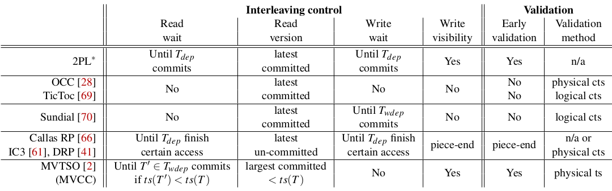
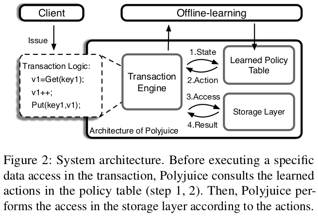
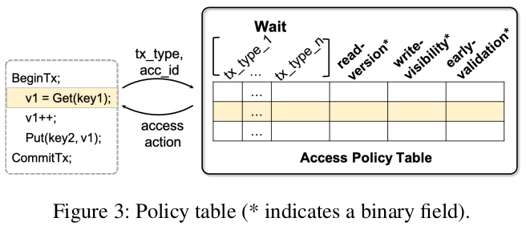

# Polyjuice(OSDI-2021) Note 

## 1 Introduction

​	设计了细粒度操作的“策略空间”，每个策略视为一个CC算法，所有策略在事务提交之前做可serializability的验证。

​	Polyjuice使用一个表来表示一个策略：行对应于不同的状态，列对应于不同的动作。Polyjuice使用基于进化的算法，已找到对于workload具有最高吞吐量的策略。

​	由于 Polyjuice 需要离线训练，因此它不适合可以快速且不可预测地变化的动态工作负载。

## 2 Background and Motivation

​	为了最大化提高吞吐量，不关心正确性。而是依靠单独的验证机制来abort non-serializable的事务。

## 3 learning Concurrency Control

​	**系统设置**：在单个多核机器上运行的内存数据库。

### 3.1 The learning framework

​	我们所学习的是为了最大化性能而应该采取的行动。良好的CC策略可以平衡事务的执行时间与事务中止的可能性。

​	**The policy space of concurrency control**：我们将策略表示为从某种执行状态到遇到该状态时要采取的特定操作的映射。动作可以分为两类：1）控制并发事务的数据访问在执行期间如何交错；2）控制何时以及如何执行验证来保证serializability。

​	**Available actions for interleaving control**：在事务执行数据访问时，插入读写到对应的 per-object access list同时更新T~dep~ 

​	在执行事务 T 时，CC算法有以下动作选择：

- *Read Control.*
  - *Wait.* 可以使T~dep~执行其冲突写早于T的读。
  - *Which version of data to read, including either committed or uncommitted version.* 这相当于选择访问列表中的哪个位置插入读取，从而影响依赖关系。
- *Write control.* 
  - *Wait.* 
  - *Whether or not to make this visible to the future reads of other transactions.* 如果写不可见，则将会被缓冲；否则，此写入以及所有T先前缓冲的写入通过将它们附加到相应的每个对象访问列表中而变得可见。与读不同，写只能被插入在列表末尾。

​	**Available actions for validation**：

- *When to validate.* 事务可以在执行期间的任何时候验证其访问，如此可以更快地abort事务避免浪费工作。
- *How to validate.* OCC风格的验证，它使用每个事务的物理提交时间戳 (cts) 作为其序列化顺序。

### 3.2 Decomposing existing CC algorithms

​	支持多种并发控制，如表所示。（2PL*指代一种近似的2PL，事务T等待直到其所有T~dep~提交后）

​	不支持由全局同意的执行顺序而具有预定义的依赖，如Calvin、Grranola、Eris、RoCoCo

​	不支持一个事务由多个线程负责，如Bohm

## 4 polyjuice Design

### 4.1 Overview

**System architecture.**Polyjuice 是一个内存多核数据库，不支持多版本。对于每个数据对象，存储其最新数据以及访问列表，访问列表包含所有可见的未提交写入以及读取访问。维护一个worker池，每个worker执行一个事务并根据学习的CC策略提交它。

**Policy Representation**：每个可学习的CC算法作为一个策略函数p，从*状态空间S*映射到*动作空间A*, p:S->A。策略函数被表示为一个表，行的数量等于不同的状态数量，列的数量等于不同动作的维度。c~i,j~表示对于访问具有执行状态i，系统应该根据动作类型j采取c~i,j~给出的动作。

**Policy-based Execution**：Polyjuice在每次数据访问时通过在策略表中查找，以确定相应的动作集合。

