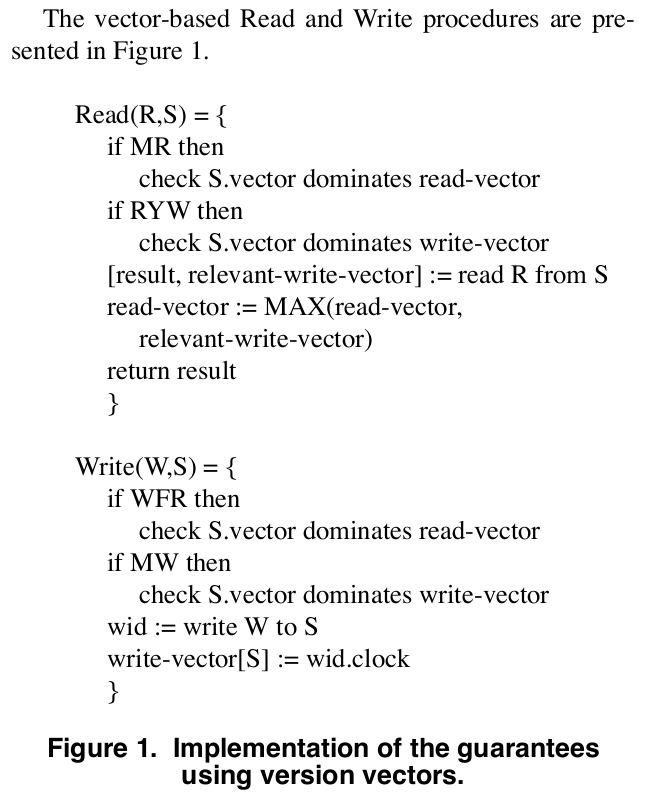

# Session Guarantees for Weakly Consistent Replicated Data

[TOC]

## Abstract

提出了弱一致性数据复制的保证：Read Your Writes, Monotonic Reads, Writes Follow Reads,
and Monotonic Writes。目的是即使应用程序可能从不一致的服务器读写，也为其提供与其自己的操作一致的数据库视图。这些会话保证是在Bayou 项目的背景下开发的。

## 1. Introduction

在本文中，我们引入了会话保证，以缓解弱一致性系统的读写顺序异常问题，同时保持 read-any/write-any 复制的主要优势。

_Read Your Writes_ - 读操作反应先前的写。

_Monotonic Reads_ - 连续读的结果是一个非递减的写入。

_Writes Follow Reads_ - 在写所依赖的读被传播后，再传播写。

_Monotonic Writes_ - 写是按他们submit的顺序传播的。

## 2. Data storage model and terminology

我们将 DB(S,t) 定义为服务器 S 在时间 t 或之前接收到的有序写入序列。

弱一致性允许不同服务器上的数据库副本不同。也就是说，对于两个服务器 S~1~ 和 S~2~，DB(S~1~,t) 不一定等价于 DB(S~2~,t)。

最终一致性依赖于两个属性：_total propagation_ & _consistent ordering_。

写入通过称为_反熵anti-entropy_的过程在服务器之间传播。

系统如何检测和解决写入冲突对其用户很重要，但对我们的会话保证没有影响。

## 3. Read/Write guarantees

参考上述定义，or[这篇文章](https://www.imooc.com/article/287817)。

DB(S,t)：Server S 在 t 时刻之前所有的写入序列

WriteOrder(W~1~, W~2~)：boolean值，指代W~1~是否应该在W~2~之前。

RelevantWrites(S,t,R)：表示对于读入R和DB(S, t)，返回最小的完全的写入集合。完全的，意思是对于确定读入R的结果是足够的。

## 4. Providing the guarantees

会话管理器，存在客户端的一个组件，它调节与可用服务器的通信。对于每个session。维护两组WIDs：

> _read-set_ = set of WIDs for the Writes that are relevant to session Reads.  与session读相关的写入WIDs

> _write-set_ = set of WIDs for those Writes performed in the session. session内执行过的所有写入WIDs

Providing the Read Your Writes：每当服务器接受写入时，其分配的 WID 就会添加到session中。在t时刻对Server进行的读之前，session manager必须检查write-set是DB(S,t)的子集。

Providing the Monotonic Reads：在t时刻对Server进行的读之前，session manager必须确定read-set是DB(S,t)的子集。此外，在每次读完，对于RelevantWrites(S,t,R)中个每个写，需要被添加至session的read-set。

实现Writes Follow Reads 和 Monotonic Writes需要对服务器施加两个额外的约束：

约束1：每当Server接受新的Write W，新的写入W被排序在Server所有已知的写入之后。

约束2：执行反熵，写入W~2~在时间t从S~1~传播到S~2~，则 DB(S~1~,t) 中的任何在W~2~之前的W~1~也被传播到S~2~。

给定约束下，Providing the Writes Follow Reads：和MR一样，每个在时刻t对于S的读入R，得到的RelevantWrites(S,t,R)结果被添加进session的read-set。在每个时间t对S的W之前，session manager检查read-set是DB(S,t)。

Providing the Monotonic Writes：在Server接受t时刻的写W前，DB(S,t)必须包含所有session的write-set。当一个W被Server接受，其WID添加到write-set。

## 5. Practical implementation of the guarantees

本节介绍如何使用版本向量来更有效地实现这四个保证。

版本向量是 <server, clock> 构成的一个序列，每个服务器一个。server是副本的唯一标识符，clock是该server单调递增的逻辑时钟值，Server每接受一次写入，clock必须递增。比如，可以为：Lamport clock，true clock or counter。<server, clock> pair serves nicely as WID，假定WID是由首先接受写入的服务器分配的。

如果一个server具有版本向量<S,c>；那么它已经收到在逻辑时间c及之前所有由S分配WID的写入。因此，反熵过程中需要按顺序传播W，servers的版本向量也在反熵中得到更新。

- 为了获得版本向量代替一组WIDs，V[S] = S的写集Ws中分配的最新WID的时间。如果没有来自S的写入，为0。

- 为了获得版本向量V，它表示两组WIDs的并集，Ws1和Ws2。首先如上所述从Ws1中获得V1，从Ws2中获得V2。然后，为所有S设置V[S] = MAX(V1[S], V2[S])。

- 为了检查是否Ws1是Ws2的子集，首先获得V1和V2。然后检查V2"dominates"V1。dominate指代在所有的分量中，一个向量均大于或等于另一个。

每个session的状态用两个vector表示：分别记录写和读。如果一个server的版本向量可以"donimates"一个或两个（取决于要执行的操作和要保证的session级别）session的向量，则此server是acceptable的。

在Read，server返回读取结果和一个版本向量用来指示相关的写入。实际中，可能难以计算relevant Writes；允许server返回其当前的版本向量作为relevant Writes的粗略估计。可能会导致session manager选择acceptable的server时更加保守。

可以使得session manager "粘"到指定的服务器上，避免连续的check。

## 6. Adding guarantees to existing systems

将四个会话保证添加到Coda。

## 7. Related work

## 8. Conclusions

