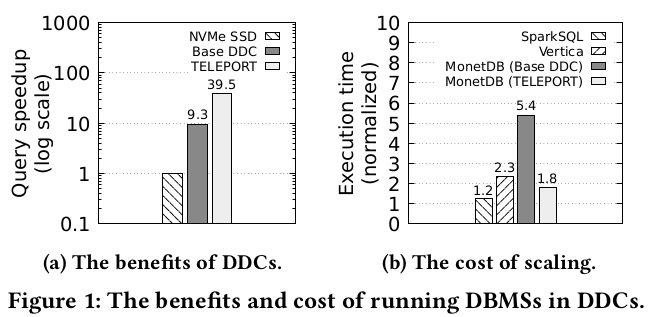

# TELEPORT

## Abstract

数据中心内计算、内存、存储和accelerators分解可以带来收益。然而内存分离的收益很垃圾。

本文提出了TELEPORT，一个用于数据密集型系统的*计算下推*框架，运行在disaggregatted的架构上。在多个系统上应用了Teleport，如列式内存DBMS、图处理系统，MapReduce系统。

## 1 Introduction

disaggregated data center (DDC)

Figure1a 说明了内存受限时，访问远端内存而不是本地SSD带来的提升。1b 对比了 MonetDB（单机内存DBMS）在 TELEPORT 和 DDC（LegoOS） 的对比（本地的计算内存资源占工作集的10%）。 SparkSQL 和 Vertica 部署在单机上作为参考。 

Teleport 是操作系统内核中的一种计算下推原语，旨在优化数据密集型系统以实现资源分解。