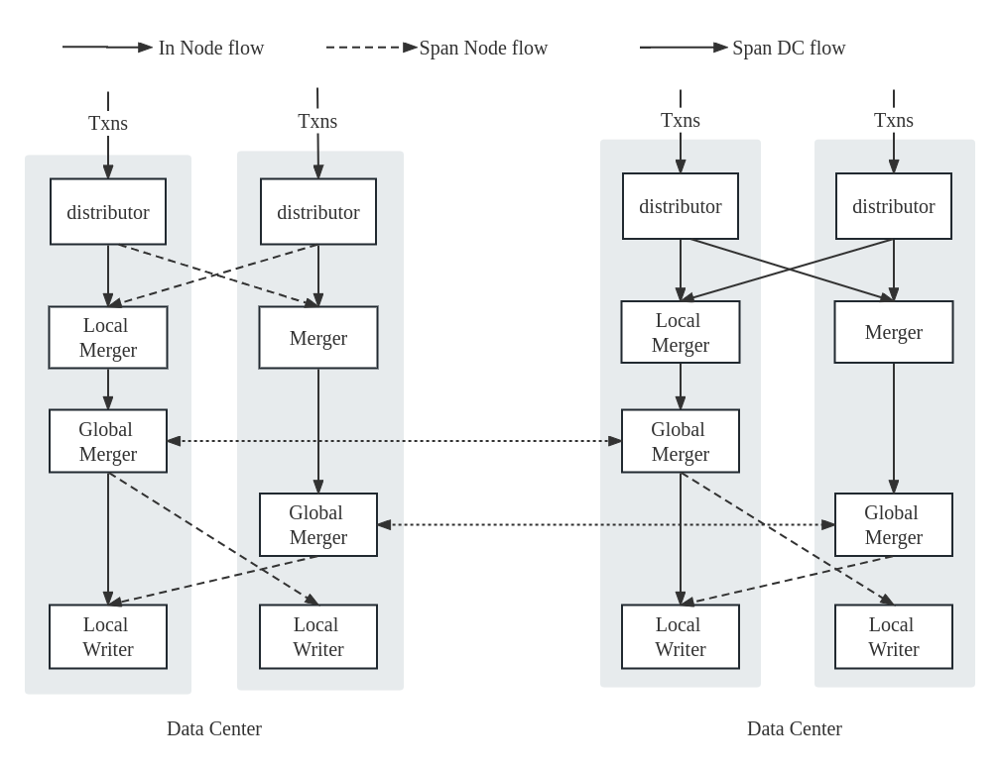

# 大纲

## 1. 背景介绍

现有的分布式 OLTP 数据库主要架构

**多主 vs 主从**

**主从**更适合写负载小，单数据中心的场景

**多主**在每个副本上提供读写能力，适合跨地域的多个数据中心部署。

同一时刻发生在多个主副本的写需要复制到整个集群以及冲突处理

**分片 vs 全副本**

**challenge** 分片带来了更好的横向扩展性，但是需要协调的代价来维持事务的原子性

**challenge** 全副本不需要诸如 2PC 来做协调，但是使得集群扩展的粒度太粗，且受制于单个节点的计算和存储性能瓶颈。

贡献：强一致的，无协调的事务处理，域间多主，域内分片架构的 KV 数据库原型。

## 2. 相关工作

确定性数据库 Calvin 、 Aria （多主分片）强隔离级别  

Calvin 单线程锁管理器，需要提前知道事务读写集，如果两个事务读写集有重叠部分，如AB，如果A卡顿住，无法通过先执行B再执行A，即使A尚未对重叠部分加锁。

Aria 读快照，写write intent，识别出 batch 利用先写胜利原则，验证 batch 内所有事务的读写集，从而 abort 所有 WAW 和 RAW 依赖的事务来做到 serializable

Calvin 和 Aria 都是 batch 粒度

Anna（多主）不支持事务 最终一致性  CRDT 

Riak 不支持事务 最终一致性 quroum

Dynamo 最近支持了有限的事务，分为 只写事务 TransactionWrite 和 只读事务 TransactionGet，且不超过25条操作，且每个Transaction中不允许对同一个item的多次操作。具有乐观锁和悲观锁两种 CC 策略。

Cassandra 不支持传统 ACID 的事务。

在先前的工作中，提出了GeoGauss，采用了多主全副本的架构，提出了一种多主事务并发处理的方案。该方案以epoch作为粒度推进，每个 epoch 中产生的一批事务异步执行、并在 epoch 结束后将这批事务的结果进行同步验证，最终确定出一个epoch的更新写集，在epoch结束后生成对应的快照，并持久化地写入存储。其实现基于华为的开源 SQL 数据库 openGauss，相较于传统的多主确定性数据库，GeoGauss能支持更弹性的隔离级别。

## 3. 系统总览

系统采用多主架构，每个主副本部署在不同的数据中心，并在数据中心内部的多个实例节点上分片，每个节点均可以接收并处理读写请求。



<center>Figure 1 system overview</center>

### 3.1 域内子事务分发

接收到一个事务，根据时间戳和本地 server id 赋予事务id，将该事务按照哈希规则划分为几个不相交的子事务。当一个epoch的所有事务都划分完毕后，根据哈希规则将他们广播到相应的域内节点上去。同时，等待接收域内所有其他节点发送过来的消息。

当消息接收完全后，对本地子事务和接收到的子事务作 write intent。

### 3.2 域间数据复制

因为是多主架构，在副本内部的子事务划分后，还需要和其他 "主" 副本上在同一个 epoch 下产生的事务做CRDT 合并，从而得到该 epoch 下最终能够确定提交的事务集合。

步骤和上一步类似，每个节点将其负责的所有子事务打包并发送给所有其他主副本上，具体发送到每个副本中根据哈希规则下相应负责的节点。这是一次发生在域间的广播，当节点收集到从其他n-1个主副本发送的消息后，即此时节点拥有当前epoch下的全量事子务。对这些子事务进行 CRDT 合并。并根据确定性规则最后通过验证得到一批可以提交的子事务以及一批需要abort的事务。

```c++
// crdt合并算法 or 图
```

### 3.3 事务原子性保证

在域间数据复制结束后，最终得到了本次 epoch 下提交的一批事务与中止的一批事务。然而，存在这样一种情形：事务T被划分为了 T1 和 T2 两个子事务，在分片A上运行T1，在分片B上运行T2。根据确定性规则，A上的T1胜出可以提交，而B上的T2失败只能abort。如果两个分片分别提交和中止，则会破坏事务的原子性。因此，如何保证原子性，即完整的事务涉及的所有分片共同提交或共同中止。

我们采取在合并完成后在域间广播 abort 的事务id集合的方式来让所有分片节点感知到其他分片的结果。在接收到所有其他域间节点的 abort 信息后，将本地验证通过的子事务且未在 abort 信息中出现的事务写入本地存储，否则中止该事务。

## 4. 无协调事务原子性保证

### 4.1 事务的生命周期

一个事务在本地执行时，根据其涉及的所有 key 值按照哈希划分为多个不相交的子事务。划分后，数据不在本地的子事务被发送到域内相应的其他节点。对于一个具有 n 个节点的的副本，每个节点在发送完成后，阻塞住直到所有其余 n-1 个节点的子事务消息都被接收到。

上一部完成后，则可以确定每个分片上当前 epoch 产生的所有写集。紧接着，所有主副本之间就这些写集进行广播交换，假定一共有n个主副本，则每个分片节点需要接收一共 n-1 个消息。当接收完毕后，每个节点拥有了当前epoch下所产生的对应于其key range的所有更新，采用确定性合并的方式产生最终的提交事务集合与中止事务集合。

最后，将中止事务集合广播发送到域内其余分片节点上，在集群经过原子性验证之后，每个分片节点将最终可以提交的子事务写入数据库。

```c++
// 算法1 事务处理算法伪代码
...
```

### 4.2 无协调的事务原子性维护

2PC 以单个事务为粒度，每个事务都有其负责的一位协调者来管理其整个生命周期，并根据事务涉及到的所有参与者节点对子事务的执行状态来决定是否中止。然而，在基于epoch的多主OCC事务并发处理方案中，2PC的方式天然不兼容，两者对事务的管理粒度不同，直接应用2PC不仅会产生大量的网络开销（单个事务的细粒度），还丧失了利用 CRDT 合并的”确定性“优势。更进一步，多主架构还会给 2PC 带来更大的挑战。

因此，适应“无协调确定性”且以epoch为粒度的原子性保证方案对分片架构至关重要。
```c++
// 算法2 epoch粒度的子事务分发与事务原子性验证 算法
...
```

在一个epoch结束后，每个节点对本次接收到的所有事务按照哈希划分为 n-1 个子事务组，每个组打包这些子事务发送到其余域内的 n-1 个节点。同时接收其余节点的消息。

在经过各个分片对于子事务的处理以及多主数据复制后，类似第一部的分发步骤，每个分片节点向域内的 n-1 个节点报告其本地关于子事务的执行结果。当节点收集完成 n-1 份结果消息时，对于其本地和远程消息的中止事务结合做并集，在得到完整的中止事务id集合。在本地所有可提交的子事务集合中，过滤出一批子事务id不在中止事务id集合的结果，最终提交并写入这些子事务到存储。

## 5. 实现

### 5.1 epoch 绑定线程

每个epoch彼此独立，更适合绑定到单个线程中去负责，几乎不会产生线程切换的开销。

### 5.2 流水线优化

为了顺序一致性，需要one by one 地推进每个epoch的写入，除此之外的过程均可以并行。

### 6 实验

vs geogauss 区域内分片相较于全副本所带来的提升

vs calvin 同样的多主分片架构

vs aria同时

